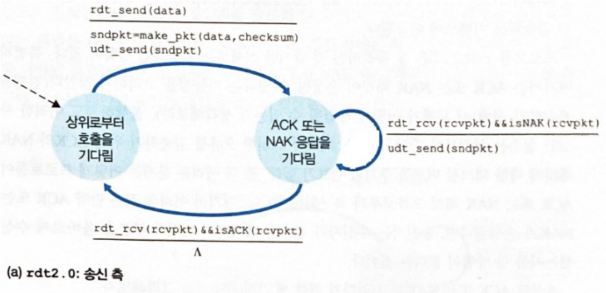
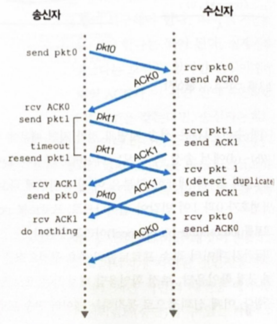

## 📚 1. 트랜스포트 계층 서비스 및 개요

- 트랜스포트 계층 프로토콜 : 애플리케이션 프로세스들 간의 논리적 통신 제공
    - 논리적 통신(Logical Communication) : 프로세스들이 동작하는 호스트들이 직접 연결된 것처럼 보이는 것
    - 실제로 호스트들은 수 많은 라우터와 링크를 통해 연결될 수 있음
- 트랜스포트 계층 프로토콜은 종단 시스템에서 구현됨
- 애플리케이션 계층 패킷인 `메시지`를 4계층 `세그먼트(segment)`로 변환
    - 애플리케이션 메시지를 세그먼트로 변환하기 위해 작은 조각으로 분할
    - 각각의 조각에 트랜스포트 계층 헤더를 추가
- 애플리케이션은 두 개 이상의 트랜스포트 계층 프로토콜을 사용 가능
    - 인터넷은 TCP와 UDP를 사용

### 1.1 트랜스포트 계층과 네트워크 계층 사이의 관계
#### 1) 트랜스포트 계층 프로토콜과 네트워크 계층 프로토콜의 비교
트랜스포트 계층은 네트워크 계층 바로 상위에 존재한다
- 트랜스포트 계층 프로토콜 : 프로세스들 사이의 논리적 통신을 제공
- 네트워크 계층 프로토콜 : 호스트들 사이의 논리적 통신을 제공

#### 2) 트랜스포트 계층 프로토콜의 역할
- 트랜스포트 계층 프로토콜은 애플리케이션에서 네트워크 경계까지 메시지를 운반
- 네트워크 계층에서 애플리케이션 프로세스로 메시지를 운반
- 트랜스포트 계층 프로토콜은 패킷이 네트워크에서 어떻게 이동하는지 알 수 없음
- 중간 라우터는 트랜스포트 계층에 대한 정보를 알 수 없음 -> 캡슐화
- 트랜스포트 계층은 네트워크 계층 프로토콜의 제약을 받음
    - 하위 계층에서 지연 보장이나 대역폭 보장을 제공할 수 없다면, 트랜스포트 계층 프로토콜은 프로세스의 메시지에 대해 지연 보장이나 대역폭 보장을 할 수 없음

### 1.2 인터넷 트랜스포트 계층의 개요
- TCP/IP 네트워크는 애플리케이션 계층에게 두 가지 프로토콜을 제공 -> TCP, UDP
    - 개발자는 소켓을 생성할 때 TCP와 UDP 중 하나를 선택해야 함
- 세그먼트(segment) : 트랜스포트 계층 패킷

##### 1) IP는 비신뢰적인 서비스
- IP는 호스트 간에 `최선형 전달 서비스(best-effort delivery service)`를 제공
    - 이는 호스트들 간에 세그먼트를 전달하기 위해 최선을 다하지만, `어느 보장도 하지 않음을 의미`
    - 즉, IP는 `비신뢰적인 서비스(unreliable service)`로, 데이터의 무결성을 보장하지 않음

##### 2) UDP & TCP의 기능
- 트랜스포트 다중화(transport multiplexing)와 역다중화(demultiplexing)
    - 종단 시스템 사이의 IP 전달 서비스 -> 종단의 프로세스 간의 전달 서비스로 확장
    - 호스트 <-> 호스트에서 프로세스 <-> 프로세스로 통신 범위를 확장
- 헤더에 오류 검출 필드를 포함하므로 무결성 검사를 제공

#### 3) UDP의 기능
- 다중화 & 역다중화 (multiplexing & demultiplexing) : 프로세스로의 통신 범위 확장
- 무결성 검사 : 헤더에 오류 검출 필드를 포함하여 무결성 검사를 진행
- 비신뢰적 서비스 제공
    - 데이터가 손상되지 않고 목적지 프로세스에 도착하는 것을 보장하지 않음
- 혼잡 제어를 제공하지 않음
    - TCP와 달리 트래픽 조절을 하지 않는다
    - 애플리케이션이 허용하는 한 어떤 속도로도 전송 가능

#### 4) TCP
- 다중화 & 역다중화 (multiplexing & demultiplexing) : 프로세스로의 통신 범위 확장
- 무결성 검사 : 헤더에 오류 검출 필드를 포함하여 무결성 검사를 진행
- 신뢰적 서비스 제공
    - `흐름제어`, `순서번호`, `확인응답`, `타이머` -> 데이터가 순서대로 정확히 전달하는 것을 보장
    - IP의 비신뢰적인 서비스를 신뢰적인 데이터 전송 서비스로 만들어줌
- 혼잡 제어 (congestion control) : 네트워크 전체를 위한 일반 서비스
    - TCP 연결이 과도한 양의 트래픽으로 네트워크 상의 스위치와 링크의 과부하를 방지
    - 혼잡한 네트워크 링크에서 각 TCP 연결이 링크의 대역폭을 공평하게 공유하여 통과하게 함
        - <b><u>송신측의 TCP가 네트워크에 보낼 수 있는 트래픽을 조절</u></b>
- 신뢰적인 데이터 전달 & 혼잡 제어를 제공하는만큼 프로토콜이 복잡함

<br>

## 📚 2. 다중화 & 역다중화 (Transport Multiplexing & Demultiplexing)
- 네트워크 계층이 제공하는 호스트 <-> 호스트 전달에서 프로세스 <-> 프로세스 전달 서비스로 확장
- 다중화와 역다중화는 모든 컴퓨터 네트워크에서 필요
- 하나의 호스트에는 여러 개의 프로세스가 동작
- 네트워크 계층으로부터 데이터를 수신하면 트랜스포트 계층은 동작중인 프로세스 중 하나에 전달할 필요가 있음

### 2.1 트랜스포트 계층 서비스의 동작
#### 1) 역다중화 (Demultiplexing)
1. 네트워크 계층에서 소켓을 통해 프로세스로 데이터를 전달
    - 소켓은 하나의 유일한 식별자를 가짐
    - 식별자의 포맷은 TCP 소켓인지, UDP 소켓인지에 따라 달라짐
2. 트랜스포트 계층 세그먼트는 소켓을 구분하기 위해 헤더 정보를 가짐
    - 트랜스포트 계층은 수신 소켓을 식별하기 위해 헤더 정보를 검사

#### 2) 다중화 (Multiplexing)
1. 송신 호스트의 소켓으로부터 데이터를 모으고, 세그먼트를 생성하기 위해 각 데이터에 헤더 정보로 캡슐화
    - 헤더 정보는 수신 호스트에서 역다중화에 사용된다
2. 세그먼트를 네트워크 계층으로 전달

<br>

```
다중화와 역다중화는 모든 계층에서 상위 또는 하위 계층으로 데이터를 받거나 넘길 때 사용된다
```

#### 3) 트랜스포트 계층 다중화의 요구 사항
1. 소켓은 유일한 식별자를 가진다
2. 각 세그먼트는 적절한 소켓을 가리키는 필드가 필요
    - `출발지 포트 번호(source port number field)` & `목적지 포트 번호(destination port number field)`
<br>

#### 4) 포트 번호
- 포트 번호 (Port number) : 0~65535까지 16비트 정수
- 잘 알려진 포트 번호 (Well Known Port number) : 0~1023
    - 이들은 애플리케이션 프로토콜에서 사용되도록 예약되어 있음
    - 애플리케이션을 개발할 때는 포트 번호를 반드시 할당해야 함
    - ex. `spring`: 8080, `react`: 3000
- 소켓은 포트 번호를 할당 받음

이것은 UDP의 기본적인 동작 방식으로 TCP의 다중화/역다중화는 더 많은 의미를 가짐

### 2.2 비연결형 다중화와 역다중화
#### 1) UDP의 소켓 식별 ⭐️⭐️⭐️⭐️
UDP 소켓 = `목적지 주소 + 목적지 포트`로 식별

`다른 출발지 IP주소 + 다른 출발지 포트 번호` or `다른 출발지 IP or 다른 출발지 포트 번호` -> 동일한 목적지 IP + 동일한 목적지 포트 번호 -> 같은 목적지 소켓을 통해 동일한 프로세스로 향한다.

<br>

```python
client_socket = socket(AF_INET, SOCK_DGRAM)
```
- UDP 소켓이 생성될 때, 포트 번호를 소켓에 자동으로 할당
- 호스트에서 UDP 포트로 사용하지 않는 1024~65535 사이의 포트 번호를 할당

<br>

만약 특정 포트 번호를 할당하고 싶다면 bind를 이용할 수 있다
```python
client_socket.bind(('', 19157))
```

<br><br>
서버의 Well Known Port 사용

```
일반적 : 서버 측이 특정 포트 번호를 할당하고 클라이언트는 동일한 포트 번호를 사용
Well Known Port 사용 : 클라이언트는 임의의 포트 번호를 사용
```

### 2.3 연결지향형 다중화와 역다중화
#### 1) TCP의 소켓 식별 ⭐️⭐️⭐️⭐️
TCP 소켓 = `출발지 주소 + 출발지 포트 + 목적지 주소 + 목적지 포트`로 식별

`다른 출발지 or 다른 출발지 포트` -> 서로 다른 소켓을 향함

<br>

```python
client_socket = socket(AF_INET, SOCK_STREAM)
client_socket.connect((server_name, 12000))
```

<br>

```python
connection_socket, addr = server_socket.accept()
```
서버 프로세스는 연결 요청 세그먼트를 수신하면, 12000 포트 번호에서 대기하고 있다가 새로운 소켓을 생성

### 2.4 지속 연결과 비지속 연결 HTTP
#### 1) 지속 연결 HTTP
지속적인 연결 존속 기간동안 클라이언트와 서버는 동일한 서버 소켓을 통해 HTTP 메시지를 교환

#### 2) 비지속 연결 HTTP
- 모든 요청, 응답마다 새로운 TCP 연결이 생성되고 종료
- 비지속 연결 HTTP는 서버 부하에 큰 부하를 준다

## 📚 3. 비연결형 트랜스포트: UDP (User Datagram Protocol)
- UDP가 `어떻게 동작`하고 `무엇인지` 학습

### 3.1 UDP의 특징
- UDP는 프로세스 간의 데이터를 넘겨주기 위한 다중화 & 역다중화, 체크섬만을 제공한다
- 3way handshaking (양방향 연결 설정)을 하지 않는다 -> `비연결형`
    - ex. DNS에서 질의 호스트가 응답을 수신하지 못하면, 질의를 다른 DNS 서버에 요청하거나 애플리케이션에 응답을 수신할 수 없음을 통보
- UDP는 혼잡제어를 하지 않음
    - 혼잡제어는 네트워크가 폭주 상태에 빠지는 것을 막기 위해 필요
    - 제어되지 않은 UDP 송신자에 의한 높은 손실률 -> 손실률을 감소시키기 위해 TCP 송신자들의 송신률을 감소시킴
        - UDP -> 높은 손실률
        - TCP -> 세션을 감소시킴

### 3.2 UDP를 사용하는 이유
1. 데이터를 보내는 시점에 대한 정교한 제어
    - 프로세스가 데이터를 UDP에 전달하면 별도의 혼잡 제어 없이 데이터를 세그먼트로 만들어 바로 네트워크 계층으로 전달
    - 실시간 애플리케이션 : 최소 전송률을 요구하며, 일부 손실을 허용하더라도 지연에 강한 통신을 필요로 함
    - 수신 여부를 확인할 때까지 재전송을 시도하는 TCP는 UDP에 비해 지연 시간이 발생함

2. 비연결 설정
    - UDP는 연결 설정을 위한 지연이 없음
    - HTTP의 TCP 연결설정은 지연을 야기한다

3. 연결 상태가 없음
    - 연결상태 : `수신 버퍼`, `송신 버퍼`, `혼잡제어 파라미터`, `순서번호`, `확인응답 번호`를 포함
    - UDP는 연결상태가 없기 때문에 위 상태 정보를 저장하지 않음
    - 더 많은 클라이언트를 수용할 수 있음

4. 작은 패킷 헤더 오버헤드
    - TCP: 20바이트의 헤더 오버헤드
    - UDP: 8바이트의 헤더 오버헤드

### 3.3 UDP 사례
- 전자 메일, 원격 터미널 접속, 웹, TCP상의 파일 전송 -> `TCP 사용`
- 네트워크 관리 애플리케이션 : 네트워크가 혼잡한 상태에 자주 동작 -> `TCP 사용`
- DNS : TCP 연결 설정 지연을 피하기 위해 -> `UDP 사용`
- 멀티미디어 애플리케이션과 같이 일부 손실을 감안하더라도 지연을 최소화시켜야 하는 경우 UDP를 사용할 수 있다

### 3.4 UDP의 혼잡제어
- 애플리케이션 자체에서 신뢰성을 제공한다면 신뢰적인 데이터 전송을 할 수 있다
- ex. 구글의 QUIC 프로토콜 : UDP상에서 애플리케이션 계층에 신뢰성을 구현
- 개발이 어렵지만, 이렇게 되면 애플리케이션 프로세스는 TCP의 혼잡 제어 메커니즘에 의한 전송률 억제를 강요당하지 않을 수 있다

### 3.5 UDP 세그먼트 구조
- `출발지 포트 번호` + `목적지 포트 번호` + `길이` + `체크섬` + `애플리케이션 데이터(payload)`
- payload를 제외한 UDP 헤더의 각 필드는 2바이트씩으로 구성됨

### 3.6 UDP 체크섬
- UDP 세그먼트 안의 비트에 대한 변경사항이 있는지 검사
- 세그먼트 헤더 안에 있는 모든 16비트 워드(각 필드)를 더하고 1의 보수를 수행 -> 체크섬 필드에 삽입
- 수신측은 헤더의 모든 값을 더해 모든 값이 1이 되는지 확인
    - 하나라도 0을 포함한다면 패킷에 오류가 발생한 것
- 종단간의 원리(end-end principle)
    - 어떤 기능이 종단 기반으로 구현될 때, 하위 레벨에 위치한 기능들은 상위 레벨에서 이들을 제공하는 비용을 비교했을 때, 중복되거나 거의 유용하지 않을 수 있다
- UDP는 오류를 검출하지만 오류를 회복하기 위해 어떤 일도 하지 않음
    1. 손상된 세그먼트를 무시
    2. 경고와 함께 손상된 세그먼트를 애플리케이션에 넘김

```
링크 계층에서 오류 검사를 제공하는데 왜 UDP가 체크섬을 제공할까?

* 링크 계층은 하나의 링크로부터 다른 링크 사이에서만 오류를 검출하고 수정할 수 있다
    * 라우터의 메모리에 저장될 때 비트 오류가 발생 가능
    * 이미 라우터에서 오류를 포함한 패킷이 다음 링크로 넘어가더라도 오류를 검출할 수 없다
* 출발지와 목적지 사이의 모든 링크가 오류 검사를 제공한다는 보장이 없다
```


## 📚 4. 신뢰성 있는 데이터 전송의 원리
### 4.1 신뢰적인 데이터 전송 프로토콜(Reliable Data Transfer Protocol)의 의무
- 신뢰적인 데이터 전송은 트랜스포트 계층뿐만 아니라 링크 계층, 애플리케이션 계층에서도 발생할 수 있는 문제
- 신뢰적인 데이터 전송에서는 데이터가 손상되거나 손실되지 않음
- 모든 데이터가 순서대로 전송되도록 보장
- 신뢰적인 전송 프로토콜 아래 계층이 신뢰적이지 않기 때문에 어려움
    - IP는 신뢰성을 보장하지 않음

### 4.2 신뢰적인 데이터 전달 프로토콜의 구축
단계별로 신뢰적인 데이터 전달 프로토콜을 구축해보자
#### 1) rdt1.0 (reliable data transfer 1.0): 손실 X 손상 X 채널
가정: 하위 채널이 완전히 신뢰적인 가장 간단한 경우
- FSM(Finit-State Machine)
    - 유한 상태 머신으로 송신자와 수신자의 동작을 정의
    - 각각의 상태머신은 하나의 상태만을 가짐
    - FSM의 상태를 초기 상태를 확인하는 것이 중요


- 평행선 위 : 변화를 일으키는 이벤트
- 평행선 아래 : 이벤트가 발생했을 때 취해지는 액션

<br>

<b>송신측 : rdt_send(data)</b>
- `packet = (make_pk)` : 상위 계층으로부터 데이터를 받아 패킷을 생성
- `udt_send(packet)` : 만들어진 패킷을 채널로 송신

<b>수신측 : rdt_rcv(packet)</b>
- `extract(packet, data)` : 하위 채널로부터 패킷을 수신하고 데이터를 추출
- `deliver_data(data)` : 추출한 데이터를 상위 계층으로 전달

완전히 신뢰적인 채널에서는 오류가 생길 수 없으므로 수신측이 송신측으로 어떠한 피드백도 제공할 필요가 없음


#### 2) ARQ(Automaitc Repeat reQuest) 프로토콜
수신자는 패킷을 보고 다음 두 응답을 송신자에게 반환할 수 있다
- 긍정 확인응답(positive acknowledgment) : OK
- 부정 확인응답(negative acknowledgment) : 다시 반복해주세요

이러한 제어 메시지는 정확하게 수신되었는지 잘못 수신되어 반복이 필요한지를 송신자에게 알려줄 수 있게 한다.

 <b>요구사항</b>
 1. 오류검출
    - 비트 오류가 발생했을 때 수신자가 검출할 수 있어야 한다
        - UDP의 체크섬 역할
    - 수신자가 패킷 비트 오류를 검출하고 복구할 수 있게 해줌
    - rdt2.0 패킷의 체크섬 필드를 사용 가능
2. 수신자 피드백
    - 송신자가 수신자의 피드백을 통해 수신자의 상태를 알 수 있음
    - 한 비트 길이의 ACK, NAK 패킷을 사용 가능
        - ACK: 1, NAK: 0
3. 재전송


#### 3) rdt2.0: 손실 X 손상 O 채널
가정: 패킷 안의 비트들이 하위 채널에서 손상될 수 있는 경우
- 비트 오류는 패킷이 전송 또는 전파되거나 버퍼링될 때 물리적 구성 요소에서 일반적으로 발생
- 모든 패킷은 순서대로 수신된다고 가정
- 오류 검출, ACK/NACK를 채택
- 전송-후-대기(stop-and-wait) 프로토콜

<br>

##### 송신측


1. 상위 계층에서 데이터를 받음 -> 체크섬을 포함해 전송하고 ACK/NACK를 기다림
2-1. NACK를 받음 -> 다시 대기함
2-2 ACK를 받음 -> 다시 상위 계층에서의 데이터를 기다림

<br>

##### 수신측


- 수신자의 FSM은 단일 상태를 가짐
1. 손상된 패킷을 받음 -> NACK를 보내고 다시 대기함
2. 손상되지 않은 패킷을 받음 -> ACK를 보내고 대기함


#### 4) rdt2.1/2.2: 손상된 ACK 또는 NACK의 처리
1. 송신자가 손상된 응답을 받으면 수신자 호스트에 응답을 다시 요청

: 수신자 호스트가 재요청을 구분할 수 있어야 한다. 응답이 다시 왜곡될 수도 있다.

2. 송신자가 검출뿐만 아니라 비트 오류로부터 회복할 수 있도록 충분한 체크섬을 포함

: 손상이 있지만 손실이 없는 채널에서는 문제를 해결 가능. 패킷이 손실될 우려가 있다면 해결되지 않는다.

3. 송신자가 왜곡된 ACK 또는 NACK를 수신하면 패킷을 다시 전송

: 수신자는 중복 패킹을 받을 수 있고, 마지막으로 전송된 ACK/NACK가 송신자에게 정확하게 수신되었는지 알 수 없음

-> stop-and-wait 프로토콜에서는 한 비트의 순서 번호(sequence number)를 이용해 해결 가능

##### 송신측(rdt2.1) - ACK/NACK 사용


1. 상위 계층에서 0번 데이터를 받음 -> 0번 패킷을 전송하고 0에 대한 ACK/NACK를 기다림

2-1. 손상된 패킷 또는 NACK를 받음 -> 0번 패킷을 다시 전송

2-2. 손상되지 않은 0에 대한 ACK를 받음 -> 상위 계층에서 1번 데이터를 기다림

3. 상위 계층에서 1번 데이터를 받음 -> 1번 패킷을 전송하고 1에 대한 ACK/NACK를 기다림

4-1. 손상된 패킷 또는 NACK를 받음 -> 1번 패킷을 다시 전송

4-2. 손상되지 않은 1에 대한 ACK를 받음 -> 상위 계층에서 0번 데이터를 기다림

##### 송신측(rdt2.2) - ACK만을 사용


1. 상위 계층에서 0번 데이터를 받음 -> 0번 패킷을 전송하고 0에 대한 ACK(0)을 기다림

2-1. 손상된 패킷 또는 ACK(1)을 받음 -> 0번 패킷을 다시 전송

2-2. 손상되지 않은 ACK(0)을 받음 -> 상위 계층에서 1번 데이터를 기다림

3. 상위 계층에서 1번 데이터를 받음 -> 1번 패킷을 전송하고 ACK(1)을 기다림

4-1. 손상된 패킷 또는 ACK(0)을 받음 -> 1번 패킷을 다시 전송

4-2. 손상되지 않은 ACK(1)을 받음 -> 상위 계층에서 0번 데이터를 기다림

##### 수신측


1-1. 손상된 패킷을 받음 -> NACK를 응답하고 다시 대기

1-2. 손상되지 않은 1번 데이터를 받음 -> ACK를 응답하고 다시 대기

1-3. 손상되지 않은 1번 패킷을 받음 -> 상위 계층으로 데이터를 올리고 ACK를 응답, 하위 계층에서 1번 데이터를 기다림

2-1. 손상된 패킷을 받음 -> NACK를 응답하고 다시 대기

2-2. 손상되지 않은 0번 데이터를 받음 -> ACK를 응답하고 다시 대기

2-3. 손상되지 않은 1번 패킷을 받음 -> 상위 계층으로 데이터를 올리고 ACK를 응답, 하위 계층에서 0번 데이터를 기다림

만약 ACK만을 사용한다면 1번 패킷을 받으면 ACK(0)을, 0번 패킷을 받으면 ACK(1)을 응답한다.

#### 5) rdt3.0: 손실 O 손상 O 채널
가정: 채널에서 패킷이 손실될 수 있고, 송/수신측에서 받은 패킷이 손상될 수도 있다

프로토콜은 다음을 처리할 수 있어야 한다
1. 패킷 손실을 검출할 수 있어야 한다

    : 타이머를 사용

2. 패킷 손실이 발생했을 때 어떤 행동을 취해야 한다
    
    : 체크섬, 순서번호, ACK, 재전송을 이용

<br>

- 송신자가 `손실 패킷의 검출`과 `회복 책임`을 가짐
- `RTT + 수신측의 패킷 처리 시간`보다 오래 기다리면 데이터를 재전송하게 됨
- 채널은 중복 패킷(duplicate data packet)의 가능성을 포함
- 다음 경우에 재전송을 하게 된다
    - 데이터 패킷이 손상된 경우
    - ACK가 손상된 경우
    - 패킷 또는 ACK가 지연된 경우
- 카운트다운 타이머(countdown timer) : 주어진 시간이 경과되면 송신자를 인터럽트
- alternating-bit protocol : 패킷의 순서번호가 0과 1이 번갈아 일어남

##### 송신측


1-1. ACK를 받아 처리한 후 대기 상태이므로 모든 응답을 무시함

1-2. 상위로부터 0번 데이터를 받음 -> 0번 패킷을 만들어 송신, 타이머를 시작 -> ACK(0)을 기다림

2-1. 손상된 패킷 또는 ACK(1)을 받음 -> 다시 ACK(0)을 기다림 

2-2. 타임아웃 -> 0번 패킷을 만들어 송신, 타이머 시작 -> 다시 ACK(0)을 기다림

2-3. 손상되지 않은 ACK(0)을 받음 -> 타이머를 종료 -> 상위로부터 1번 호출을 기다림

3-1. ACK를 받아 처리한 후 대기 상태이므로 모든 응답을 무시함

3-2. 상위로부터 1번 데이터를 받음 -> 1번 패킷을 만들어 송신, 타이머를 시작 -> ACK(1)을 기다림

4-1. 손상된 패킷 또는 ACK(0)을 받음 -> 다시 ACK(1)을 기다림

4-2. 타임아웃 -> 1번 패킷을 만들어 송신, 타이머 시작 -> 다시 ACK(1)을 기다림

4-3. 손상되지 않은 ACK(1)을 받음 -> 타이머 종료 -> 상위로부터 0번 호출을 기다림

##### rdt3.0의 동작
1. 정상 동작


- 송신자와 수신자 간의 송신과 수신이 반복됨

<br>

2. 패킷 손실


➀. 송신자의 패킷이 손실되어 `time out`이 발생

➁. 송신자는 이전에 보낸 패킷을 다시 전송

<br>

3. ACK 손실


➀. 수신자의 ACK 패킷이 손실되어 `time out`이 발생

➁. 송신자는 이전에 보낸 패킷을 다시 전송


<br>

4. 조급한 time out


- 타이머 시간이 짧아 ACK 패킷을 받기 전에 `time out`이 발생

➀. 송신자가 재전송하고 수신자로부터 ACK를 받음

➁. 재전송한 패킷에 대한 ACK를 수신하기 전에 다음 패킷을 전송함

③. 재전송한 패킷에 대한 ACK가 오면 버림

### 4.3 파이프라인된 신뢰적 데이터 전송 프로토콜
- stop-and-wait 프로토콜은 하나의 패킷만을 주고받기 떄문에 전송 효율(채널 이용률, utilization)이 떨어짐
- 파이프라이닝(pipelining) : 여러 개의 패킷을 전송하고 확인응답을 기다리지 않음
    - 순서번호의 범위가 커져야 함
    - 패킷은 유일한 순서번호를 가져야 함
    - 송신 측과 수신 측은 한 패킷 이상을 버퍼링함
        - 확인 응답되지 않은 패킷은 버퍼링
    - Go-Back-N, Selective Repeat 사용

#### 1) Go-Back-N(GBN)

- 파이프라인에서 응답이 안된 패킷의 최대 허용 수는 N보다 크지 않아야 함
- N 크기의 슬라이딩 윈도우를 가짐
- 송신측만 버퍼를 유지하고 수신측은 별도의 버퍼를 유지하지 않음
- 패킷의 순서가 잘못되면 슬라이딩 윈도우에 있는 패킷들을 모두 재전송하므로 효율성이 떨어짐

##### 송신측


1. 슬라이딩 윈도욱 가득 차지 않은 상태에서 상위 계층에서 데이터를 받음
    - 패킷을 만들어 전송
    - 현재 바라보는 패킷이 슬라이딩 윈도우 내에서 가장 오래된 패킷이라면 타이머를 다시 시작
    - 가장 오래된 패킷이 아니라면 타이머를 다시 시작하지 않음
    - 슬라이딩 윈도우가 가득 찼다면 상위 계층으로부터 데이터를 받지 않음
2. `time out`
    - 슬라이딩 윈도우에 있는 모든 패킷을 다시 전송
    - 타이머를 다시 시작
3. 손상되지 않은 ACK를 받음
    - 슬라이딩 윈도우를 한 칸 움직임
    - 더 이상 보낼 데이터가 없다면 타이머를 멈춤
    - 슬라이딩 윈도우가 움직이고 패킷이 존재한다면 (슬라이딩 윈도우 내에서 가장 오래된 패킷에 대해) 타이머를 다시 시작 

##### 수신측


1-1. 오류가 없으며 기대하는 순서의 패킷을 수신
    - 데이터를 상위 계층으로 전달
    - 패킷에 대한 ACK를 날림
    - 다음 순서의 패킷을 기다림

1-2. 오류가 있거나 기대하는 순서의 패킷이 아닌 다른 패킷을 수신
    - 수신한 패킷을 버림
    - 마지막으로 보낸 AKC를 다시 보냄

수신자 입장에서는 다음 순서 패킷의 순서번호만을 저장하면 되기 때문에 별도의 버퍼를 관리할 필요가 없음

##### GBN 예외 상황 처리
1. 송신측 패킷이 손실됨
    - 손실된 패킷 이후 보내진 패킷들은 수신측에서 버려짐

2. `time out`
    - `time out`된 패킷부터 다시 전송

3. 수신측의 ACK 손실
    - ACK를 받지 못한 패킷부터 다시 전송

#### 2) Selective Repeat, SR
- GBN은 불필요한 재전송을 너무 많이 하기 때문에 효율성이 떨어짐
- SR은 의심되는 패킷만을 송신자에게 다시 전송하므로 불필요한 재전송을 피함
- 순서가 틀린 패킷은 더 낮은 순서번호를 수신할 때까지 버퍼에 저장
- 송신자와 수신자의 슬라이딩 윈도우 상태는 같지 않음
- 윈도우 크기는 SR 프로토콜의 순서번호의 절반 이하여야 함

## 📚 5. 연결지향형 트랜스포트 : TCP
TCP는 신뢰적인 데이터 전송을 위해 `오류 검출`, `재전송`, `누적 확인응답`, `타이머`, `순서번호`, `확인응답 번호` 등을 헤더 필드에 포함시킴으로써 앞의 원칙들을 구현

### 5.1 TCP 연결
- 연결지향형(connection-oriented)
- 전이중(full-duplex) 서비스
- TCP 연결은 항상 단일 송신자와 단일 수신자 사이의 점대점(point-to-point)
    - 단일 송신 동작으로 멀티캐스팅이 불가능
- 연결 설정 과정에서 송/수신 버퍼, 변수, 프로세스에 대한 초기화가 이루어짐

#### 1) Three way handshaking
- 클라이언트는 서버로 TCP 연결 초기화를 시도
- 클라이언트-서버의 처음 두 세그먼트는 페이로드를 포함하지 않음
- 세 번째 세그먼트부터 페이로드를 포함해 데이터를 전송
- three way handshaking을 통해 연결 설정이 되면 두 프로세스는 통신이 가능해짐
- 연결 설정을 할 때 송신 버퍼(send buffer)와 수신 버퍼(receive buffer)가 초기화됨
- TCP는 데이터 스트림을 보내고, MTU(Maximum Transmission Unit)에 따라 MSS(Maximum Segment Size)가 정해짐
    - MSS는 헤더를 포함하지 않은 페이로드의 최대 크기를 나타냄

### 5.2 TCP Segment 구조
- TCP는 용량이 큰 리소스를 전송할 때, MSS 크기로 파일을 쪼갠다
    - MSS보다 작다면 그대로 세그먼트를 전송한다
- 헤더는 최소 20바이트를 사용하고 `option` 필드에 따라 더 커질 수 있다
    - UDP는 2Byte씩 4개의 필드를 사용 (`src port`, `dst port`, `header length`, `checksum`)
    - TCP는 신뢰적인 데이터 전송을 위해 UDP에 비해 추가적으로 12Byte 이상을 더 사용
    - 순서번호 = 4Byte, 확인응답번호 = 4Byte, 헤더길이 = 2Byte
    - `RST`, `SYN`, `FIN` 등의 추가적인 비트가 사용됨

#### 1) 순서번호와 확인응답 번호 ⭐️⭐️⭐️⭐️
- TCP는 데이터를 구조화되어 있지 않은 데이터 스트림으로 인식
- 순서번호(Sequence Number) : 일련의 전송된 세그먼트가 아닌 바이트 스트림에 대한 것
- 스트림 번호 = 첫 번째 바이트
- 확인응답 번호(Acknowledge Number) : 
- TCP는 전이중 통신으로, 두 호스트 A, B가 통신할 때 A -> B가 기대하는 확인응답 번호와 B -> A가 기대하는 확인응답 번호는 다르다
- 순서가 잘못된 세그먼트에 대해 호스트는 두 가지 선택을 할 수 있다
    - 표준 처리가 지정되어 있지 않다
    - GBN : 수신자가 순서가 틀린 세그먼트를 모두 버림
    - SR : 순서가 틀린 데이터를 보유하고, 잃어버린 데이터를 채우기 위해 대기
    - 보통 SR 기반의 방식을 사용
- TCP 연결의 시작 번호는 이전에 네트워크에 남아있는 세그먼트와의 오인을 최소화하기 위해 임의의 숫자를 사용

#### 2) 피기백 (PiggyBacked)
- 클라이언트-서버 데이터에 대한 확인응답은 서버와 클라이언트 간에서 데이터를 운반하는 세그먼트 안에서 전달된다
- ACK는 다음으로 기대하는 확인 응답 번호를 나타낸다