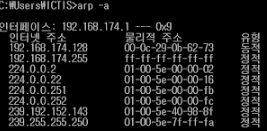

### ARP
> 네트워크 계층 주소(IP주소)와 링크 계층 주소(MAC주소) 들을 서로 변환해주는 기능을 수행한다.
> 즉, 같은 서브넷의 다른 IP 주소를 가진 데이터그램을 전달하기 위해 MAC주소로 변환해주는 기능이다.

 

### ARP 동작 방식
> 종단 시스템 1 IP 주소 : 111.111.111.111 
> 종단 시스템 2 IP 주소 : 222.222.222.222 
> 조건 1 : 각 종단 시스템은 같은 서브넷에 존재한다. 
> 조건 2 : ARP 테이블에 목적지에 대한 엔트리가 존재하지 않는다. 

- 종단시스템 1은 각 서브넷의 모든 호스트, **라우터에게 질의**한다.
- 라우터는 질의 받은 **MAC주소를 브로드캐스팅 방식으로 전송**한다.
- 다른 호스트, 라우터는 **자신의 IP주소가 전달받은 MAC주소와 일치하는지 확인**한다.
  - **일치한다면 라우터에게 응답**해주고, 일치하지 않으면 응답하지 않는다.  
- IP주소와 MAC주소가 일치한 노드로부터 응답을 받으면 해당 매핑 정보를 자신의 **ARP 테이블을 갱신**한다.
- 프레임으로 캡슐화하여 링크 계층으로 전달한다.
  - 이때, 프레임의 MAC 주소는 브로드캐스팅으로부터 알아낸 MAC주소이다.

 

### ARP 테이블

    </img>

- ARP 테이블은 IP주소와 MAC 주소 간 매핑 정보를 포함한다.
- 일반적인 엔트리의 종료 시간은 20분이다.

 

### 만약 같은 서브넷이 아니라면 ?
위에서 본 ARP 동작 방식은 같은 서브넷에 존재하는 경우이다. 
그렇다면 같은 서브넷이 아니라면 어떻게 동작하는지 알아보자.

#### 동작 방식
- 자신이 속한 서브넷의 라우터에게 전달한다.
- 라우터는 목적지 주소가 자신의 서브넷에 존재하는지 확인한다.
  - 존재하면 위 동작 수행하고, 존재하지 않으면 네트워크 계층으로 전달한다.
- 네트워크 계층의 라우터는 포워딩 테이블을 참조하여 알맞은 서브넷의 라우터로 데이터 그램을 전달한다. 
- 해당 서브넷의 라우터는 목적지 MAC주소 찾아서 데이터를 전달한다.

       