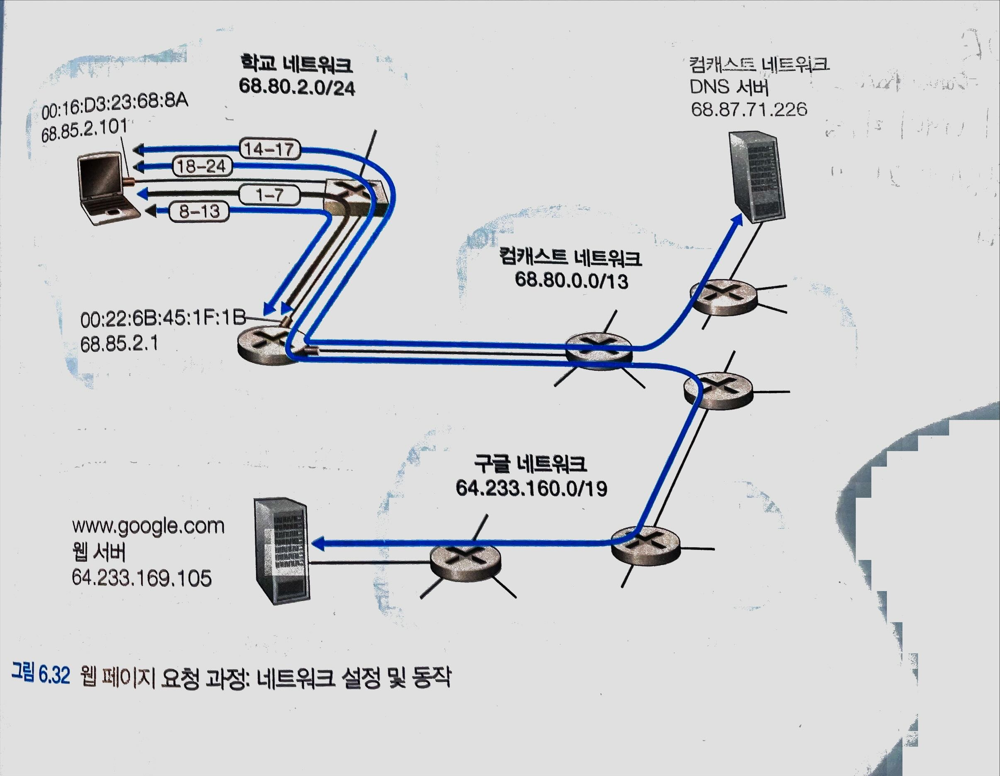

# 7. 총정리 : 웹 페이지 요청에 대한 처리
 

 

## 1. 랩탑을 학교 네트워크에 연결 - IP 할당
- 밥이 학교 서브넷 네트워크에 연결하였다.
- 우선 IP주소를 받아와야 한다.

### 순서

1. 해당 이더넷 스위치에 보낼 이더넷 프레임 생성 → DHCP discovery 메시지
    - IP 데이터 그램 출발지/목적지 : 0.0.0.0 / 255.255.255.255
    - MAC 이더넷 프래임 출발지/목적지 : 밥 MAC주소 / FF:FF:FF:FF:FF:FF
2. 이더넷 스위치가 목적지 MAC 주소를 보고 브로드캐스팅
3. 라우터가 이걸 DHCP 요청 메시지가 담긴 이 이더넷 프레임 수신, IP 데이터그램을 추출,
4. IP 데이터 그램을 보고 DHCP로 전송
5. DHCP 서버가 데이터그램을 역다중화(UDP) 하여 DHCP 메시지를 확인
6. DHCP 서버가 DHCP ACK 메시지를 만든다
    - DHCP IP 주소, IP 주소, 디폴트 게이트웨이 라우터 주소, 서브넷 블록, DNS IP 주소 포함
7. 만든 메시지를 UDP 세그먼트에 들어가고, 세그먼트는 IP 데이터그램에 IP 데이터그램은 이더넷 프레임에 들어간다.
    - MAC 주소 출발지/목적지: 홈 네트워크 라우터의 MAC 주소/ 밥의 랩탑 맥주소
8. 이 이더넷 프레임은 라우터에 의해 스위치로 이동한다.
9. 스위치의 자가학습 기능으로 인해 알아서 밥의 랩톱에 전송
10. DHCP 메시지를 역다중화하여 자신의 IP 주소와 DNS 서버의 주소를 IP 포워딩테이블에 넣는다.

## 2. DNS 서버를 가기 1단계 - ARP
- DNS 서버를 가려면 링크계층을 통해 가기에(스위치) 라우터의 MAC 주소도 알아야 한다.
- DHCP 통신으로 라우터의 IP 주소는 알게 되었지만 MAC 주소는 모른다.

### 순서

1. DNS 서버에 구글의 IP 주소 요청(www.google.com)
    - 메시지 : 질의문 www.google.com이 담긴다
    - 세그먼트 : UDP
    - IP 데이터 그램 출발지/목적지 : 밥 IP/DNS IP
    - 이더넷 : 몰?루 → ARP 프로토콜 시작
2. ARP 질의 메시지 작성 후 스위치로 전송
    - IP 주소 - 출발지: 밥의 IP / 목적지: 라우터의 IP
    - MAC 주소 - 출발지: 밥의 MAC 주소/ 목적지: FF:FF:FF:FF:FF:FF
3. 스위치가 수신 후 MAC 주소를 보고 라우터 주소 뿐만 아니라 연결된 라우터들 모두에게 전송
4. 해당 라우터가 IP를 보고 수신한 뒤 ARP 응답메시지 작성 후 스위치로 전송
    - IP 주소 - 출발지: 밥의 IP / 목적지: 라우터의 IP
    - MAC 주소 - 출발지: 밥의 MAC 주소/ 목적지: 라우터 MAC 주소
5. 스위치가 자가학습으로 밥의 랩탑으로 바로 보냄
6. 밥의 랩탑이 ARP 응답 메시지에 포함된 라우터의 MAC 주소 획득

## 3. DNS 서버 가기 2단계 - DNS
- 라우터의 주소까지 얻었으니 DNS 서버에 해당 주소 IP 주소를 요청한다.

### 순서

1. 1단계에서 만든 DNS 질의가 담긴 프레임을 스위치가 라우터로 전송
2. 라우터가 DNS 서버 네트워크로 보내야 하는 것을 앎
3. 라우터의 포워딩 테이블에서 목적지 IP 주소를 찾아 데이터 그램에 넣고 해당 라우터로 전송
4. DNS 서버 네트워크 라우터가 프레임을 수신 후 IP 데이터그램을 보고 DNS 서버로 보낼 인터페이스를 구축해 데이터그램을 만들어 전송
5. DNS 서버에 캐싱된 주소가 있다 가정하고, 자원 레코드에서 해당 주소를 찾아 다시 프래임 생성
    - 메시지 : DNS 질의 응답 메시지
    - 세그먼트 : UDP
    - IP 데이터 그램 : DNS 서버 IP / 밥의 IP
    - 이더넷 프래임 : 홈 네트워크로의 MAC 주소 / 밥 랩탑 MAC 주소
6. 라우터가 이걸 받아 포워딩 테이블에서 IP를 확인 한 후 게이트웨이 라우터에 전해주고 이걸 스위치로 전해주고 밥 렙탑까지 이어진다.
7. 밥의 랩탑은 DNS 서버의 응답메시지를 역다중화하여 열어서 구글의 IP주소를 알아낸다.

## 4. 웹 서버 - 클라이언트 상호작용 : TCP 와 HTTP
- IP주소, MAC 주소 모두 갖춰졌다. → HTTP,TCP를 이용하여 통신
- 애플리케이션 계층과 트랜스포트 계층

### 순서

1. 먼저 HTTP GET 요청 전에 연결요청인 3-way handshaking을 해야한다.
   메시지에 아무것도 넣지 않고 , TCP에서 SYN=1 을 넣는다 → 후에 전송
    - IP 주소 출발지/목적지 : 밥의 IP 주소/ 구글의 IP주소
    - MAC 주소 출발지/목적지 : 밥의 MAC 주소/ 게이트웨이 라우터의 MAC 주소
2. 스위치, 라우터(포워딩 테이블을 이용하여 라우팅)를 통해 이동하여 구글 네트워크 라우터에 도착
3. 구글 라우터의 NAT 포워딩 테이블을 통해 구글 서버에 접근
4. SYN=1 에대한 TCP SYNACK를 세그먼트에 넣고, 데이터그램에, 프래임에 넣고 다시 전송
5. 역다중화 하여 밥의 랩탑은 ACK를 확인하고 SYN=0으로 바꾸고 실요청을 보낸다.
6. 구글 서버의 응답