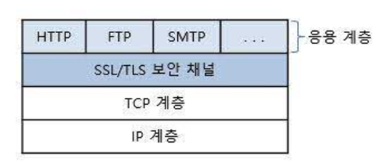
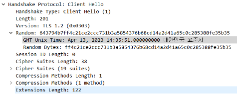
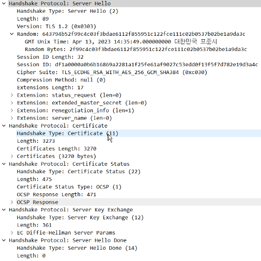
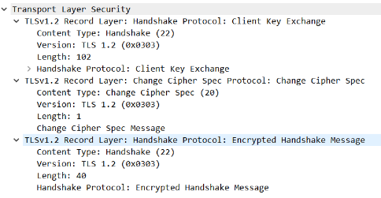

## SSL / TLS ( Secure Sockey Layer / Transport Layer Secure )

- SSL : 웹 사이트와 브라우저(혹은, 두 서버) 사이에 전송된 데이터를 암호화하여 인터넷 연결 보안을 유지하는 표준 기술이다.
  - 즉, 네트워크 통신을 할 때 보안을 제공하기 위해 설계된 암호 규약이다.
- TLS : SSL의 취약점을 보완해서 나온 업데이트 버전이다.

    </img>

## TLS HandShake 동작과정

### 1. 클라이언트가 서버에게 첫 메시지를 보낸다. (ClientHello)

</img>

- Random : 32바이트의 난수 값
- sessionId : 처음 생성 시 빈값, 존재하면 세션 ID 전달
- cipher suite : 클라이언트가 지원 가능한 키 교환 알고리즘, 대칭키 암호 알고리즘, 해시 알고리즘 등 전달

  

### 2. 서버는 클라이언트 요청에 대해서 응답 메시지를 보낸다 (ServerHello, Certificate, Server Key Exchange, ServerDone)

</img>

- ServerHello : 서버가 클라이언트에게 보내는 메시지
- Certificate : 서버는 클라이언트에게 자신의 인증서를 보낸다.
  - 인증서를 보내는 이유는 클라이언트의 입장에서 서버가 신뢰할 수 있는 서버인지 확인하기 위해서이다.
  - 이때, 클라이언트의 웹 브라우저는 유명한 CA의 목록과 공개키를 가지고 있어서 공개키를 이용해서 인증된 서버인지 확인할 수 있다.
- Server Key Exchange : 인증서 안에 서버의 공개키가 없는 경우, 대신 이 메시지를 보낸다.
- Server Done : 클라이언트와 서버간 신원 확인을 마무리하는 메세지이다.

  

### 3. 클라이언트는 서버간 암호화 통신을 위한 메세지를 보낸다. (Client Key Exchange)

2단계에서 클라이언트는 인증서를 통해 신뢰할 수 있는 서버라는 것을 확인했다.  
따라서, 데이터 암호화하기 위한 데이터 전송을 위한 대칭키를 생성해야한다.

</img>

- Cient Key Exchange : 데이터 암호화하기 위한 대칭키(Pre-Master Key)를 보낸다.
  - 이때, 대칭키는 절대 외부에 노출되어서는 안된다. 그러므로 서버의 공개키로 대칭키를 암호화한다. 
    -> 암호화 방식 : 2단계에서 서버로부터 받은 랜덤 값과 함께 조합하여 만든다. 
    -> 즉, 대칭키는 서버의 개인키로만 복호화할 수 있다는 것이다.

  

### 4. 서버는 전달받은 대칭키를 복호화하여 세션 생성

서버가 클라이언트로부터 대칭키를 받으면 자신의 개인키를 이용해서 Pre-Master Key를 획득한다.
그리고 Premaster-Master Key를 이용해서 Master Secret을 만들어 저장하고, 그 Master Key를 이용해서 세션 키를 만들어서 저장한다.
그리고 클라이언트에게 완료 메세지를보낸다.

> 주의 할 점 !!!  
> 서버가 생성한 세션키를 담아서 보내는 것이 아니라는 것이다 !  
> 클라이언트는 완료 메시지를 받으면 Pre-Master Key를 이용해서 독립적으로 동일한 세션키를 생성한다.
