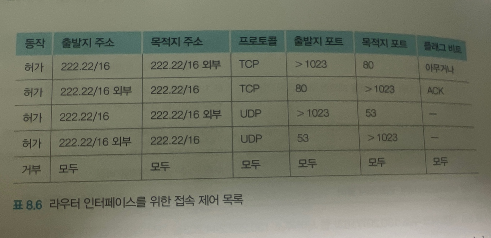
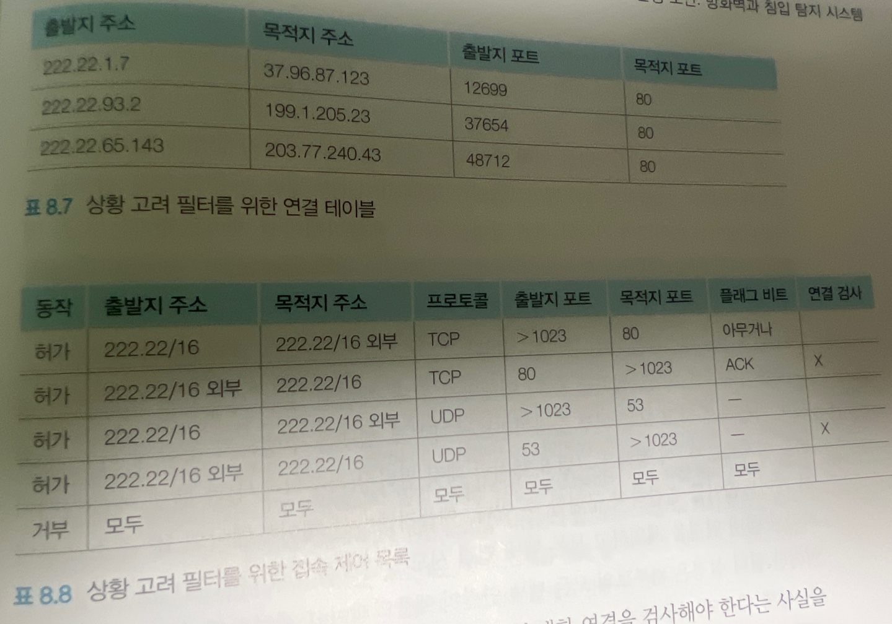
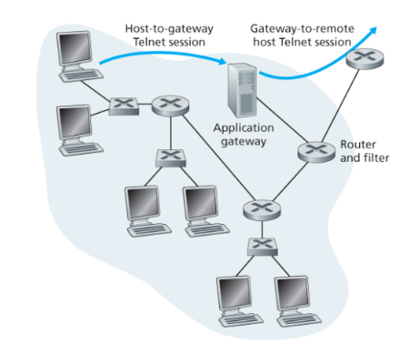

## 운영 보안 : 방화벽과 침입 탐지 시스템

### 방화벽

- 방화벽은 전체 인테너세으로부터 기관의 내부 네트워크를 분리시킨 하드웨어와 소프트웨어의 조합으로, 특정 패킷은 통과되고 특정 패킷은 차단된다. ( 필터와 같은 역할 ...?)
- 즉, 네트워크에 대한 트래픽 출입을 관리하는 것으로 외부 세계와 관리 네트워크 간 접속을 제어할 수 있는 것이다.

### 방화벽의 목표 3가지

- 인바운드, 아웃바운드의 모든 트래픽은 방화벽을 거친다.
- 승인된 트래픽만 통과가 허용된다.
- 방화벽 자체가 침입 시도에 안전해야한다.

## 방화벽의 3가지 종류

- 전통적인 패킷 필터 (Traditional Packet Filter)
- 상황 고려 필터 (Stateful Filter)
- 애플리케이션 게이트웨이 (Application Gateway)

 

### 전통적인 패킷 필터

일반적으로 하나의 네트워크는 인터넷과 연결하기 위해 ISP에 연결하는 게이트웨이를 가진다. 
그리고 네트워크에 대한 인바운드, 아웃바운드 모두 해당 게이트웨이를 거치게된다. 
그리고 게이트웨이를 통과할 때, **패킷 필터링**이 일어난다.

패킷 필터링 과정에서 검사하는 요소 아래와 같다.

- IP 출발지 or 목적지 주소
- IP 데이터 그램 내 프로토콜 타입 : TCP , UDP , ICMP , OSPF 등
- TCP or UDP 출발지와 목적지 포트
- TCP 플래그 비트 : SYN , ACK 등
- ICMP 메시지 타입
- 네트워크에서 나가는 데이터그램과 들어오는 데이터그램에 대한 서로 다른 규치귿ㄹ
- 서로 다른 라우터 인터페이스에 대한 서로 다른 규칙들

 

### 라우터 인터페이스를 위한 접속 제어 목록

</img>

- 규칙1 은 내부에서(1023) 외부(80)로 나가는 TCP 패킷 허용
- 규칙2 는 외부에서(80) 내부(1023)으로 들어오는 ACK 비트가 1인 TCP 패킷에 대해 허용
- 규칙3 은 내부에서(1023) 외부(53)으로 나가는 모든 UDP 패킷을 허용
- 규칙4 는 외부에서(53) 내부(1023)으로 들어오는 모든 UDP 패킷을 허용
- 이외에 모두 거부한다.

이처럼 방화벽은 위 사진과 같은 접속 제어목록과 함께 라우터에 구현된다.  

 

### 상황 고려 필터

전통적인 패킷 필터의 방식에서는 패킷이 위,변조 되었을 경우에는 제대로된 필터를 수행하지 못하게 된다.

이러한 문제를 해결하기 위해 상황 고려 필터는 TCP 연결을 추적하여 이 정보를 패킷 차단 결정을 하는데 이용한다.
이에 따라, 전통적인 패킷 필터의 접속제어 목록에서 **연결 검사라는 필드가 추가** 되었고, **연결 테이블도 추가**되었다.

</img>

동작 순서

- 패킷이 방화벽에 도착하면 연결검사 필드를 확인한다.
- 연결검사가 필요할 경우 연결 테이블과 일치한다면 패킷을 통과시킨다.

### 애플리케이션 게이트웨이

더 세밀한 수준의 보안을 위해서 방화벽은 패킷 필터를 애플리케이션 게이트웨이와 결합해야한다.
예를들어, 제한된 범위의 일부 내부 사용자들에게만 텔넷 서비스를 제공해야한다면 ?  
-> 전통적인 필터나 상태 고려필터로는 한계가 존재한다.

왜냐하면 전통적인 필터나 상태 고려 필터에서는 헤더에 대한 값만 참조하는데, 헤더에 사용자 인증에 대한 정보를 담지 못하기 때문이다.

</img>

그림에 대해 설명하면,

1. 애플리케이션 게이트웨이의 IP주소로부터 시작된 텔넷 연결을 제외하고 모든 텔넷 연결 시도를 막는다.
2. 사용자는 애플리케이션 게이트웨이와 텔넷 세션을 설정한다.
3. 게이트웨이에는 입력되는 텔넷 세션 요청을 듣고 있는 애플리케이션이 있어서 사용자에게 ID와 비밀번호를 요구한다.
4. 애플리케이션 게이트웨이는 사용자에 대한 인증을 진행한다.

- 허가 된다면, 게이트웨이와 외부 호스트간 텔넬 연결을 설정한다.
- 허가되지 않는다면, 게이트웨이에서 세션이 종료된다.

하지만, 단점은 아래와 같다.

- 각 애플리케이션마다 서로 다른 애플리케이션 게이트웨이를 필요로한다.
- 모든 데이터가 게이트웨이를 경유하여 중계되므로 성능상의 손실이 있다.
- 클라이언트 소프트웨어는 사용자가 요구할 때 어떻게 게이트웨이와 통신할 수 있는지 알아야 하며, 어떤 외부 서버에 연결할지 애플리케이션 게이트웨이에게 알려줄 수 있어야한다.
