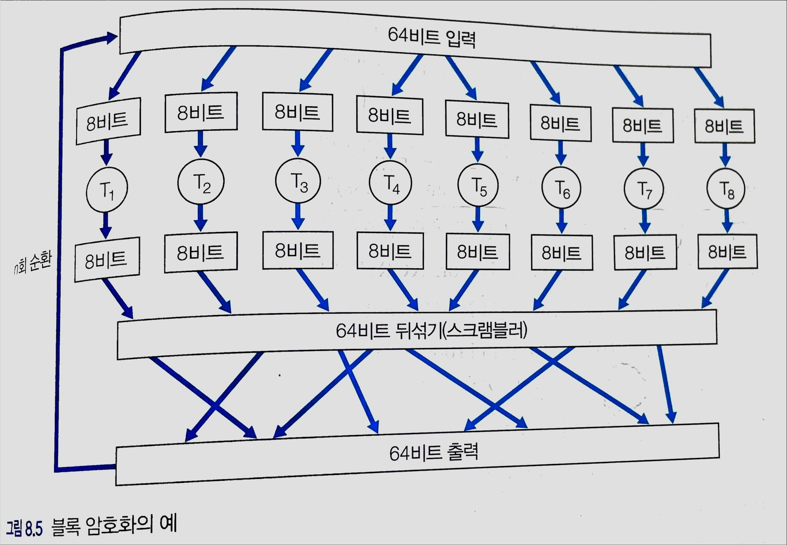
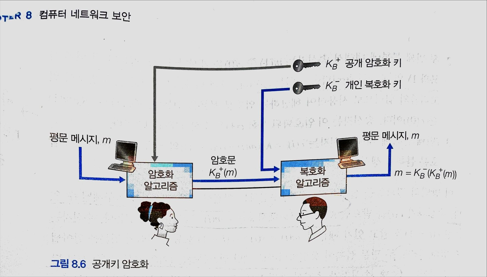
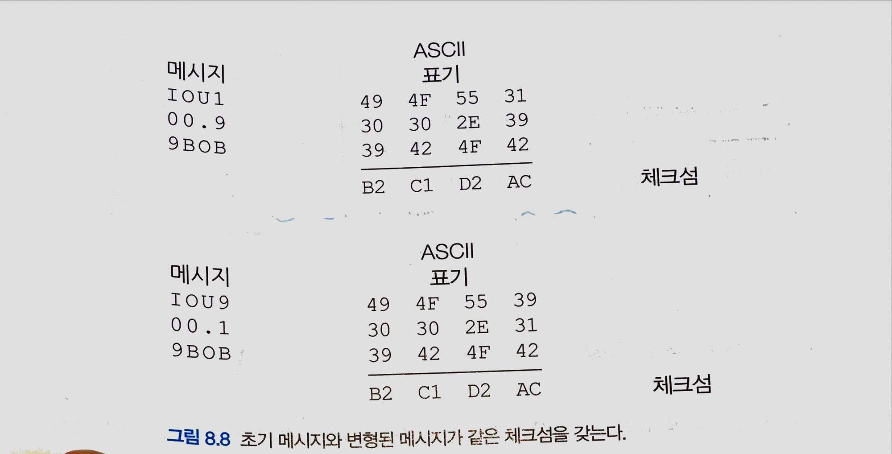
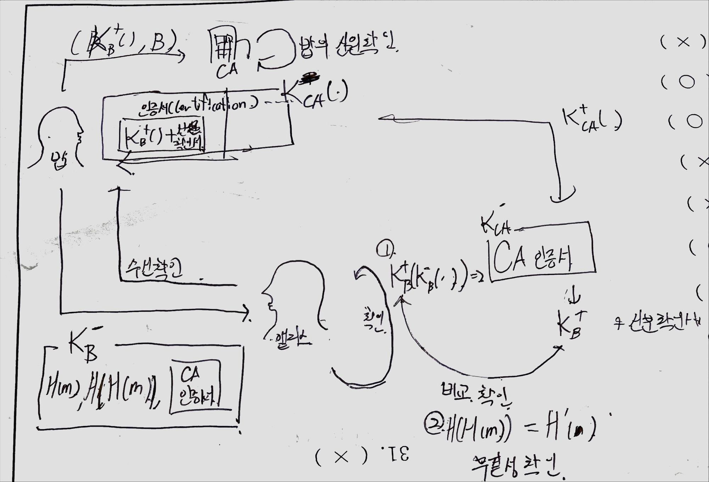

### 1. 네트워크 보안

- 기밀성 : 암호화를 하여 송신자와 지정된 수신자만 알아볼 수 있도록 한 것
- 메시지 무결성 : 데이터가 조작이나 변동 없이 무결해야한다.
- 종단점 인증 : 송신자와 수신자가 서로의 신원을 확인/확신할 수 있어야한다
- 운영보안 : 방화벽, 문제점 보고 등으로 운영을 보호한다.

### 2. 암호의 원리

- 평문 , 원문 : 원래 형태의 메시지
- 암호문 : 암호화된 메시지
- 암호화 알고리즘 : 평문을 암호문으로 만들어주는 알고리즘
- 복호화 : 암호문을 평문으로 바꿔주는 것
- 복호화 알고리즘 : 복호화 하는 알고리즘
- 대칭키 시스템 : 송수신자들 간 갖고있는 둘 만의 같은 비밀키
- 공개키 시스템 : 한 쌍의 키가 제공된다. 하나는 모두가 알지만 다른 키는 송수신자 둘 중 한 명만 갖고있다.

### 3. 대칭키 암호화
### 0. 전통방식의 암호화

- 카이사르 암호 : k 번째 뒤의 수나 문자로 바꾸는 것
- 단일 문자 암호화 : 한 문자를 다른 문자로 바꾸는 것
- 다중 문자 암호화 : 한 문자를 여러 문자로 바꾸는 것

### 1. 블록 암호화 - 현대

- k개의 비트로 문자를 쪼개서 암호화하는 방식이다 → k 블록단위의 암호화
- 완전 테이블 기반 암호화
    - 특정 사상 테이블대로 하는 암호화이다
    - 실제로 사용은 불가능
- 블록 암호화
    - 입출력 블록의 순열 테이블을 임의로 모방 생성하는 함수
    - k=8일때의 예시

  

    - 8bit의 8개의 청크(`$T_i$`)로 이뤄진 테이블로 처리가되는 예시이다.
    - 예를 들어 입력된 것들 중 처음으로 쪼개진 8비트는 `$T_1$의 청크` 로 처리된다.
    - 그렇게 처리된 출력을 더 좋은 암호화를 위해 n회 순회한다.
      ⇒ 라운드를 여러번 반복하는 이유는 각 입력 비트가 대부분의 최종 출력 비트들에 영향을
      미치게 하기 위해서이다.
    - 오늘날 널리 쓰이는 것들
        - DES(Data Encryption Standard) : 56비트의 키를 64비트의 블록과 함께 사용
        - AES(Advanced Encryption Standard): 128비트의 블럭을 사용,
          128, 192, 256 비트의 길이의 키를 사용

### 2. 암호 블록 체이닝

- 다른 평서문 블록이 같은 암호문 블록이 될 수 있다.
- 위의 경우와 같은 평서문이라도 달라지게 하기위해 임의성을 추가한 것
    - k비트의 r(i) 임의문을 XOR 을 이용해 암호화 하는 예가 있다
      전송방식 : 평문1, r(1), 평문2, r(2)….
    - 이럴 경우 r(i)에 따라 달라지기 때문에 같아지는 경우 방지가 가능하다
    - 문제점
        - 임의의 수를 넣어서 푸는 것이 가능
        - 전송시 하나의 평문에 하나의 임의문을 넣어야 해서 대역폭을 두 배로 써야한다.
- 위의 문제점을 해결한 암호 블록 체이닝
    - 순서
    1. 임의의 평서문 k비트열 초기화 백터(Initial Vector)를 c(0) 생성 후 수신자에게 보낸다.
    2. 첫 번째 블록 : c(1) =  m(1) XOR c(0)
    3. 두 번째 블록: c(2) = m(2) XOR c(1)
    - 처음 보낸 초기화 백터를 이용하여 계속적으로 암호화시키는 것이다
    - 장점
        - 수신자는 c(i)를 받는 다면 복호화가 가능하다
            - $K_s$ 알고리즘을 통해 복호화가 가능(비밀키 S를 이용), 이렇게 되면 c(i-1)도 알 수 있어 원문도 확인이 가능해진다.
        - 앞에 암호문에따라 계속 바뀌기에 더욱더 변칙적이다
        - IV를 암호화하지 않아도 S 키를 모르면 알 수가 없음
        - 원문마다 하나씩 더 임의문을 보내 많은 대역폭을 썼던 것과 다르게 하나의 초기화 백터만 보내서 미미한 대역폭 증가량을 볼 수 있다.

### 4. 공개키 암호화
- 기존 대칭키의 경우 무조건 서로 키를 갖고 있어야만 복호화 및 암호화가 된다는 단점이 있다.
- 이를 보완하여, 암호화 시키는 `공개키` 와 복호화를 시켜주는 `개인키` 를 사용 한 공개키 방식이 생겼다.

- 공개키의 대략적인 개요
    1. 앨리스가 밥에게 메시지를 보내려 한다. 이 때 모두에게 공개되어 있는 공개키 `$K_B^+()$` 에 평문 `m`을 넣어
       암호문 `c = $K_B^+(m)$` 를 만들어 밥에게 보낸다
    2. 밥은 앨리스가 보낸 암호문`c` 를 받아 밥만이 갖고 있는 개인키 `$K_B^-()$` 에 암호문 `c` 를 넣어
       복호문 `s=$K_B^-(c)$` 를 만들어 메시지를 확인한다. 즉, `$K_B^-(K_B^+(m))$` 를 계산하는 것이다.

  ⇒ 이러한 단일 공개키는 앨리스든 앨리스인턱 하는 누구든지 밥에게 암호화된 메시지를 보낼 수 있다.

### ❇️ RSA

- 위의 문제와 관련된 공개키의 아주 대표적인 예시이다.
- 모듈러 연산의 간단 법칙 (a mod b는 a를 b로 나눈 나머지의 값이다.)
    - `a mod n + b mod n = (a+b) mod n`
    - `a mod n - b mod n = (a-b) mod n`
    - `(a mod n) * (b mod n) = (a*b) mod n`
    - `$($$a$ mod n$)^d$ mod n =  $a^d$ mod n`
- RSA 암- 복호화 방법
    1. 2개의 큰 소수 `p,q`를 고른다. 이 때 p,q 의 곱은 1024 bit 보다 커야한다.
    2. n=p*q, z=(p-1)(q-1) 값을 구한다
    3. 1 이 아닌 z의 공통요소가 아닌 수이며, n보다 작은 값인 e를 구한다.
    4. ed mod n = 1 인 값이 될 수 있는 d를 구한다.( (ed-1) mod n = 0 )
        1. 이 때 암호화키는 $K^+()$ 는 (n, e)의 쌍을 제공
        2. 복호화 키는 $K^-()$는 (n, d)의 쌍을 제공한다.
    5. 암호화 : `c = $m^e$ $mod$ n`
    6. 복호화 : `$s$ =  $c^d$ $mod$ $n$`
- RSA가 암복호화가 되는 이유
    - 암복호화 되는 과정을 정수론을 통해 보게되면 알 수 있다.
    1. 평문`m` 이 공개키로 암호화된 암호문 `c`이 들어온다
        - `$c = m^e$ $mod$ $n$`
    2. 이를 복호화하는 과정에서 어떻게 이뤄지는지 볼 수 있다.
        - `$s =$ $c^d$ $mod$ $n$ = $(m^e$ $mod$ $n$$)$$^d$ $mod$ $n$`
        - `$(m^e$ $mod$ $n$$)$$^d$ $mod$ $n$ = $(m^e)^d$ $mod$ n`
        - m^(ed mod n) mod n = m mod n = m
- RSA는 그럼 완전한 암복호화 알고리즘인가?
    - 그렇지 않다. 왜냐하면 RSA의 보안은 공개 값 n을 인수분해하여 2개의 소수 p 와 q를 찾는 빠른 알고리즘이 없다는 점에 기반하는데, 만약 빠른 알고리즘이 생긴다면 보안을 보장할 수 없기 때문이다.(실제로 현재 있을지도 모르고…)

### ❇️ 세션키

- 공개키와 대칭키를 합쳐서 사용한 것이다.
- 암복호화 과정
    1. 앨리스는 $K_s$ 라는 비밀 대칭키를 갖고 있다.
    2. 밥과 통신하기 위해서 밥의 공개키를 이용하여 암호화 한 뒤 밥에게 전송한다
        - `$K_B^+(K_s())$` 의 형태로 밥에게 전달
    3. 밥은 수신한 앨리스키의 암호문을 밥의 개인키로 열어 앨리스의 대칭키를 얻는다.
        - `$K^-_B(K_B^+(K_s())) = K_s()$` 로 얻게된다.
    4. 그리고 이 대칭키로 암호화 하여 통신한다.

### 5. 메시지의 무결성과 전자서명

- 앞에서 메시지의 기밀성에 대해 얘기했으니, 메시지의 무결성 문제를 본다
- 무결성 검사
    - 올바른 송신자인지 확인
    - 메시지가 변경되진 않았는지 확인

### 6. 해쉬함수
- 아주 복합적인 계산으로 암호화를 해주는 함수이다.
- 체크섬과 비교
    - 1의보수와 윤회적 자리올림을 사용하는 체크섬은 기밀성의 관점에서 보면 매우 빈약하다.
- 이를 보안하기 위하여 체크섬에 해쉬함수를 엮어야 한다.
    - 예시
        1. 문자 하나를 한 바이트로 취급
        2. 4 바이트를 하나의 청크로 묶는다.
        3. 각 청크들을 더한다.

      → 이렇듯 해쉬함수로 바로 적용하기에는 체크섬이 너무 허술하여 이런식으로 바꿔준 뒤 해쉬함수 진행

- 다양한 해쉬 알고리즘
    - MD5 : 오늘날 널리 쓰이는 알고리즘
        - 덧붙이기 단계 : 메세지가 끝나는 부분에 1 나머지를 0으로 채우는 방식
        - 추가 단계 : 메세지가 끝난 후 메세지의 길이를 뒤에 추가하는 단계
    - SHA-1 : 미국 연방의 애플리케이션에 안전한 암호화 해시 알고리즘이 필요할 떼 쓰인다.

### 7. 메시지 인증코드(MAC)
- 기밀성 보다는 메시지의 무결성을 더 중점적으로 보는 링크계층을 중점으로 만든 것
- 기본 순서
    1. 메시지 `m`을 받고 해쉬 `$H(m)$` 를 계산한다.
    2. 메시지 m에 H(m)을 첨부한 확장 메시지를 수신자에게 전한다.
    3. 수신자는 `$m$`의 `$H(m)$`을 구하여 같이 온 `$H(m)$`과 비교하여 무결성을 확인한다.

  → 문제점 : `$m$`을 변경한 `$m'$`을 넣은 해쉬 `$H($$m'$$)$` 갑을 함께넣은 확장 메시지를 보내면 모른다.

### ❇️ 이를 해결할 수 있는 MAC(Message Authentication Code)

1. 인증키 사용
    - MAC은 비밀 대칭키 `$s$` 를 사용한다.(송수신자 모두 갖고 있음)
    - 메시지에 덧붙여서 사용 → `$m+s$`
    - 해시에 이걸 대입 `$H(m+s)=h$` 를 만들어서 확장 메시지 (m, h)를 전송한다.
      → 이것이 바로 메시지 인증 코드(MAC)이다.
2. 인증키 `s` 전송 방법
    1. 물리적으로 전송
    2. 라우터 마다 공개키를 갖고 있으므로 이것을 이용하여, 공개키로 말아서 전송하여
       라우터들에게 인증키를 전달한다.

### 7. 메시지 무결성 전자서명
### 1. 메시지 무결성

- 메시지가 조작되진 않았는지 확인해야한다.
- 체크섬의 1의 보수로는 보안적으로 취약하다.
- 이를 위해 그 누구도 풀기 힘든 해쉬 함수를 이용한다.
- 메시지 `m` 를 해쉬 함수로 돌려`$H(m)$`, 메시지 m 함께 묶어 전송한다.
- 대표적인 해쉬 함수로는 SHA-1 과 MD5 가 있다.

### 2. 메시지 인증 코드(Message Authentication Code, MAC)

- 위의 해쉬 함수로 메시지 무결성을 지킬 수는 있어도, 메시지`$m$` 자체를 변형하여 해쉬 함수에 넣고 돌리면
  무결성의 의미가 없어진다 ex)  `$(m$, $H(m)) ≠$ ($m'$,$H(m'))$`
- 그래서 메시지 무결성을 위해 인증키 `$s$` 를 사용한다.
- 송신자는 메시지에 인증키를 결합하여 `$m+s$`  를 해쉬 함수에 넣는다.`$H(m+s)$` ⇒ `$(m$$, H(m+s))$`
- 수신자는 메시지를 풀어서 메시지 `m` 에 인증키 `s` 를 결합하여 해쉬함수에 넣어 비교하여 메시지 무결성을 확인한다.
- 대표적인 예시로 해쉬 함수를 두 번에 걸쳐 사용한 HMAC가 있다.
    - MD5와 SHA-1과 함께 사용이 가능하다.
- 이 때  송수신측은 미리 같은 인증키를 갖고 있어야한다.
    - 직접 인증키를 배포
    - 링크 상태의 라우팅 알고리즘의 경우, 각각의 라우터에 있는 공개키를 이용하여 인증키를 공개키로 암호화하여 `$K_R(s)$` 네트워크를 통해 전달한다.

### 3. 전자 서명

- 송신자가 자신이 맞음을 확인하는 인증을 위한 방법
    - 송신자의 개인키로 암호화하고 수신측은 송신자의 공개키로 메시지를 확인하여 인증을 한다.
- 메시지의 무결성까지 확인해준다.
    - 메시지를 조작해도 원본 메시지를 송신자의 개인키로 암호화했기에, 공개키로 꺼냈을 때 두개를 서로 비교하며 비교가 가능하다.
- 이 때 암복호화할 때 연산이 너무 과중하다 → RSA (비대칭키)의 문제점
    - 해쉬 알고리즘을 이용하여 고정된 길이의 지문을 계산하여 사용
- MAC과 차이점
    - 인증키만을 사용하여 메시지의 무결성만 확인하는 MAC와 다르게, 송신자의 개인키를 사용하여 메시지의 무결성과 인증까지 확인하는 전자서명은 좀 더 무거운 기술이다.
- 공개키 인증의 결점과 CA(Certification Authority)
    - 전자 서명은 공개키를 이용하여 복호화를 하는데, 공개키는 어떻게 인증가능 할까?
      ⇒ 해커가 수신자의 공개키인 척 넘기고 수신자인 척 조작된 메시지를
      잘못된 공개키의 비밀키로 암호화시킨 경우
    - 공개키가 신뢰적이라고 확인 시켜주는 신뢰기관 CA를 이용한다.

