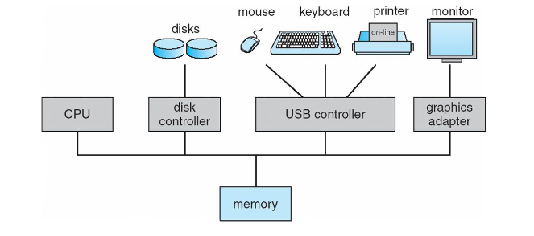
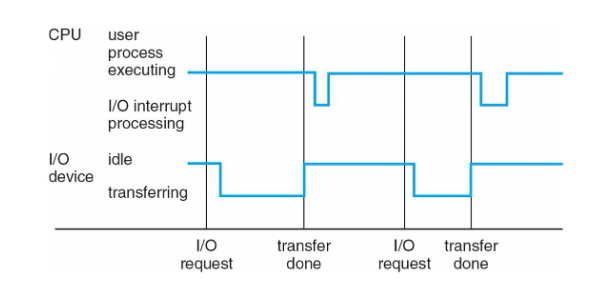
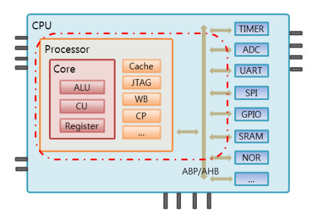
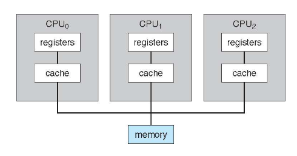
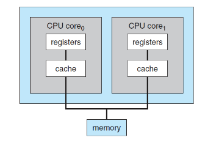
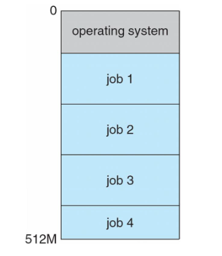
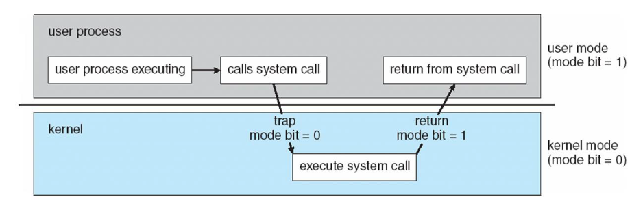

# 1.1 운영체제가 할일

- 시스템 구성 : 하드웨어, 응용 프로그램, 사용자, 운영체제 ( 4가지 구성 )
  - `하드웨어` : 중앙처리장치, 메모리 입출력 장치로 구성되어있고, 기본 계산용 자원을 제공
  - `응용프로그램` : 워드프로세스, 스프레드시트, 컴파일러, 웹 브라우저 등과 같은 프로그램이며, 사용자의 계산 문제를 해결하기 위한 것
  - `운영체제` : 다양한 사용자를 위해 다양한 응용프로그램 간 하드웨어 사용을 제어하고 조정한다.

## 1.1.1 컴퓨터에 대한 사용자 관점

- 사용자 관점은 사용되는 인터페이스에 따라 달라진다.
- 사용자는 마우스, 키보드, 모니터 등의 장치로 조작하기 때문에 운영체제는 다양한 입력 장치를 통해 입력을 수행할 수 있도록 설계되었고, 효율적으로 제어할 수 있는 환경을 제공한다.

## 1.1.2 시스템 관점

- 시스템 관점은 하드웨어와 가장 밀접한 프로그램이다. (자원 할당자라고도 부른다.)
- 즉, 운영체제는 문제를 해결하기 위해 여러 자원들을 가지고 이들을 관리자로서 일을 한다.

## 1.1.3 운영체제 정의

- 운영체제에 대한 명확한 정의는 존재하지 않는다.
- 하지만, 운영체제는 시스템 관점, 사용자 관점에서 많은 기능을 수행한다.

 

    🤔 그렇다면 운영체제를 왜 사용하는걸까 ?
    컴퓨터 시스템의 기본 목표는 프로그램을 실행하고 사용자 문제를 쉽게 해결하는 것이다.
    하지만 기술이 발전하면서 컴퓨터의 범용성이 커지면서 기능이 확대되고 크기가 작아졌다.
    이에따라 자원을 제어하고 할당하는 일반적인 기능을 수행하기 위해 운영체제가 등장하였다.

## 📋 정리

    - 컴퓨터 이에서 항상 실행되는 하나의 프로그램
    - Kernel로도 정의할 수도 있다 ?
    - 하드웨어를 제어하는 소프트웨어
    - 응용 프로그램과 하드웨어 사이의 중계자

  

# 1.2 컴퓨터 시스템 구성

    </img>

- 컴퓨터 시스템은 하나 이상의 CPU와 구성요소와 공유 메모리 사이의 접근을 제공하는 공통 **버스**를 통해 연결된 여러 장치 컨트롤러로 구성된다.
- CPU와 장치 컨트롤러는 병렬로 실행되어 메모리 사이클을 놓고 경쟁한다. ( 경쟁 ...? )
- 그리고 운영체제는 각 장치 컨트롤러마다 장치 드라이브러를 가진다.

 

## 1.2.1 인터럽트 (Interrupts)

    인터럽트는 컴퓨터 시스템에서 중요한 이벤트가 발생했을 때, 현재 실행 중인 작업을 일시 중단하고 즉시 특정 코드(인터럽트 핸들러 또는 서비스 루틴)를 실행하는 매커니즘을 말한다.

 

#### 예시 : 입출력에서의 인터럽트 호출하는 과정

    1. 장치 드라이버는 장치 컨트롤러의 적절한 레스터에 값을 적재한다.
    2. 장치 컨트롤러는 레지스터의 내용을 검사하여 수행할 작업을 결정한다.
    3. 컨트롤러는 장치에서 로컬 버퍼로 데이터를 전송한다.
    4. 장치드라이버는 요청을 운영체제에게 제어르 넘긴다.

이때, **장치 컨트롤러가 장치 드라이버에게 작업을 완료했다고 신호를 발생시키는 것이 인터럽트**이다.
즉, 인터럽트는 "트리거" 역할을 한다. 장치 컨트롤러부터 이벤트가 발생했을 때 장치 드라이버의 작업을 유발하는 매커니즘을 말한다.  

예를들어, CPU가 인터럽트가 되면 CPU는 하던일을 중단하고 다른일 수행하게 된다. 이때 다른일을 하기 위한 메모리 주소를

 

#### 예시 : CPU에서의 인터럽트된 과정

    </img>

    1. CPU 인터럽트 발생
    2. 수행 중 작업 중단하고 즉시 고정된 위치로 실행을 옮긴다.
    3. 인터럽트 서비스 루틴 실행
    4. 서비스 루틴 실행 완료 후, 1번 전 수행 중이던 작업 재개

- 즉, 장치 컨트롤러가 인터럽트 요청 라인에 신호를 선언하여 인터럽트를 발생시키고 CPU는 인터럽트를 포착하여 인터럽트 핸들러 디스패치하고 핸드러는 장치를 서비스하여 인터럽트를 지운다. d

 

### 기본 인터럽트 메커니즘

    1. CPU가 컨트롤러의 인터럽트 요청 라인에 신호를 감지한다.
    2. 인터럽트 번호를 읽고 인터럽트 벡터의 인덱스를 사용하여 인터럽트 핸들러 루틴으로 이동한다.
    3. 해당 인덱스와 관련된 주소에서 작업을 수행한다.

- `인터럽트 벡터 테이블` : 인터럽트가 발생했을 때 CPU가 인터럽트 핸들러의 주소를 빠르게 찾을 수 있도록한다.(인터럽트 핸들러의 시작 주소를 가지는 테이블))
- `인터럽트 핸들러 루틴` : 인터럽트가 발생했으 때 실행되는 특수한 함수 또는 코드 블럭이다.

 

### 오늘날 최신 운영체제가 필요로하는 인터럽트 처리 기능

- 중요한 처리 중 인터럽트 처리를 연기할 수 있는 기능
- 장치의 적절한 인터럽트 핸들러로 효율적인 디스패치하는 기능
- 우선순위가 높은 인터럽트와 우선순위가 낮은 인터럽트를 구분하고 대응할 수 있는 기능

 

### 📋 정리

    이처럼 하드웨어가 작동 중에 CPU에게 알려주는 신호를 말하며, 시스템 버스를 통해 CPU에게 신호를 전송함으로써 어느 시간이더 하드웨어는 인터럽를 발생시킬 수 있으며, 최신 운영체제에서 비동기 이벤트를 처리하기 위해 사용되고 다양한 인터럽트가 발생한다.

    따라서 시스템 성능을 좋게 하려면 효율적인 인터럽트 처리가 필요하다.

#$ 1.2.2 저장장치 구조

### 메인 메모리

- RAM이라고 불린다.
- 휘발성의 특징을 가진다.

### 보조저장장치

- 대량의 데이러틑 영구치 보존할 수 있다.
- HDD, SSD NVM과 등이 있다.

### 3차 저장장치

- 각 저장 장치 시스템은 데이터를 저장하고 검색될 때 까지 해당 데이터를 유지하는 기능을 제공한다.

### 📋 정리

    각 저장장치 별 상호보완적이라는 것을 알게 되었다.
    따라서 각 저장장치 별 균형을 맞추어야 시스템 효율이 올라간다는 것을 알게되었다.

 
 

# 1.3 컴퓨터 시스템 구조 (Computer System Architecture)

- CPU
  - 명령을 실행하는 하드웨어
- Processor
  - 하나 이상의 CPU를 포함한 물리적 칩
- Core
  - CPU의 기본 계산 단위
  - 코어는 CPU 내부의 실행 엔진으로 실제로 명령어를 처리하고 연산을 수행한다.
  - 코어들은 CPU 내부에 위치하여 독립적으로 작동하거나 벙렬적으로 수행할 수 있다.
  - 독립적으로 작동한다는 말은 운영체제가 제어할 수 없다는 말이다.
  - 따라서 **오늘날 컴퓨터 시스템은 단일 처리를 하는 코어를 가지는 단일 프로세서 시스템은 거의 없다.**

## 1.3.1 단일 처리기 시스템 (Single Processor Systems)

    </img>

- 단일 처리 코어를 가진 하나의 CPU를 포함한 프로세서를 말한다.

 

## 1.3.2 다중 처리기 시스템 (Multiprocessor Systems)

### 대칭형 다중 처리 구조

    </img>

 - 단일 코어 CPU가 2개 이상의 프로세스를 말한다.
 - 프로세서의 수가 늘어났으므로 처리량이 증가한다.
    - 하지만 프로세서 개수를 N만큼 증가한다고 처리율이 N만큼 증가하지 않는다.
    - 공유 자원에 대한 경헙이 발생하기 때문이다.
- CPU가 독립적이기 때문에 특정 CPU는 유휴상태에 빠지고, 특정 CPU는 과부하가 발생할 수도 있다.

 

### 이중-코어 설계

    </img>

- 하나의 CPU 칩에 여러개의 코어를 통합하여 성능을 항샹시키는 컴퓨터 구조이다.
- 멀티 코어는 병렬 처리를 가능하게하고, 다수의 작업을 동시에 처리할 수 있다.

 

## 1.3.3 클러스터형 시스템 (CLustered Systems)

- 둘 이상의 독자적 시스템 또는 노드들을 연결하는 것을 말한다.
- 클러스터 컴퓨터는 저장장치를 공유하고 근거리 통신망이나 InfiniBand와 같은 고속의 상호 연결망으로 연결된다.
- 높은 가용성을 목표로한다.
  - 클러스터 내 하나 이상의 컴퓨터 시스템이 고장 나더라도 서비스를 계속 제공하는 것을 말한다.

### 비대칭형 클러스터링

- 다른 컴퓨터들이 응용 프로그램을 실행하는 동안 한 컴퓨터는 긴급대기 모드 상태를 유지하는 것이다.
- 즉, 긴급 대기 모드의 호스트는 활성 서버들을 모니터링을 수행하다가, 장애가 발생했을 때 대신 활성화되는 것을 말한다.

### 대칭형 클러스터링

- 둘 이상의 호스트들이 응용 프로그램을 실행하고 서로를 감시하는 것이다.
- 비대칭형과 달리 모든 서버가 활성되어있다는 점에서 더 효율적이다.
  - 따라서 하나 이상의 응용 프로그램들이 실행 가능해야한다.

## 📋 정리

    공부하기 전에는 CPU가 많으면 좋은 줄 알았다. 하지만 이중-코어 설계와 대칭형 다중 처리기 시스템을 비교하면서 무조건 CPU가 많다고 성능이 올라가는 것이 아니라 공유 자원에 대한 경합으로 성능이 안좋아질 수 있다는 것을 알게 되었다.

  

# 1.4 운영체제의 작동 (Operating System Operations)

## 1.4.1 다중 프로그래밍과 다중 태스킹 (Multiprogramming And MultiTasking)

- 운영체제는 여러 프로그램을 실행하기 위해 하나의 프로그램은 일반적으로 계속해서 CPU를 사용할 수 없다.

### 다중 프로그래밍

    </img>

- 다중 프로그래밍은 메모리에 여러개 프로그램을 적재하고 여러 프로그램을 전환하여 효율을 극대화하는 것이다.
- 다중 프로그래밍은 CPU가 항상 한 개를 실행할 수 있도록 프로그램을 구성하여 CPU 이용률을 높이고 사용자 만족도를 높인다.
  - 즉, 여러 프로그램을 이용할 수 있도록한다. -> 프로그램 시스템에서 실행 중인 프로그램을 프로세스라고한다.
- 다중 프로그래밍 시스템에서 운영체제는 여러 프로세스들을 전환하여 실행한다.
  - 이러한 방법으로 CPU가 유휴상태에 빠지지 않게한다.

 

### 다중 태스킹

- 다중 태스킹은 다중 프로그래밍의 **논리적 확장**이다.
- 여러개의 프로그램이 수행될 수 있는 것을 말합니다.
- CPU 스케줄링에 따라서 다중 태스킹을 가능하도록 도와줍니다.

 

## 1.4.2 이중-모드와 다중모드 운용 (Dual-Mode And MultiMode Operation)

    </img>

### 유저 모드

- 사용자가 접근할 수 있는 영역을 제한적으로 두고, 프로그램의 자원에 함부로 침범하지 못하는 모드이다.
- 유저 모드에서 코드를 작성하고, 프로세스를 실행하는 등의 행동을 할 수 있다.

### 커널 모드

- 잘못된 프로그램으로 인해 다른 프로그램이 잘못 실행되지 않도록 하기 위한 모드이다.
- 커널 모드는 모든 자원에 접근, 명령을 할 수 있다.

🤔 📋
