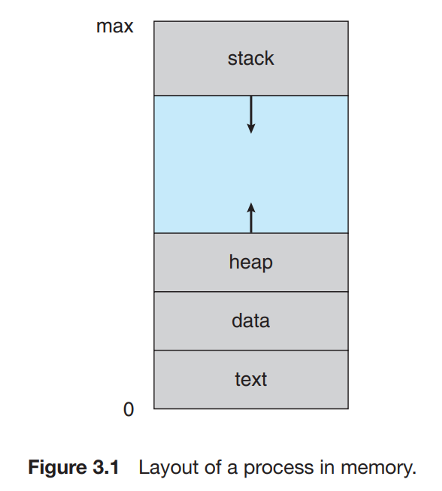
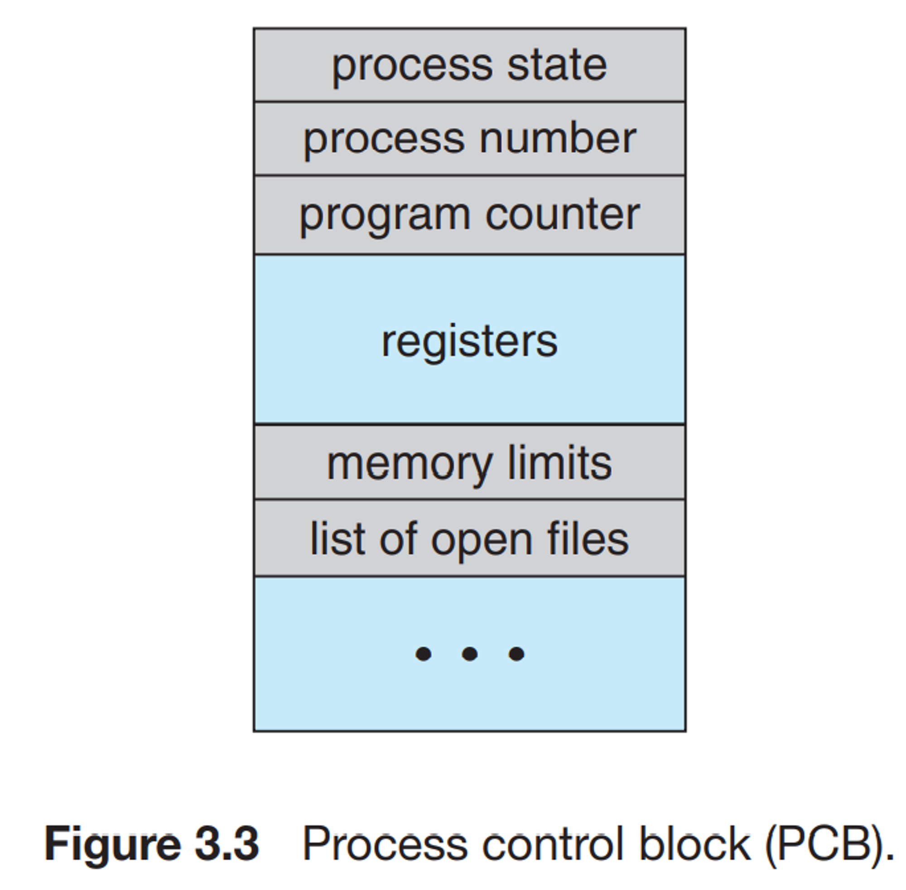
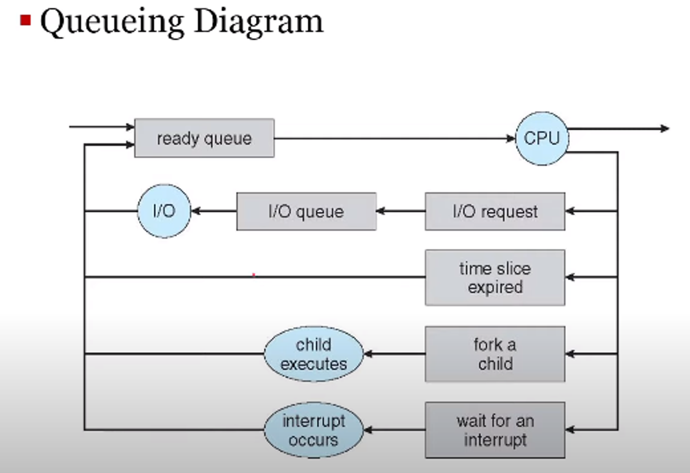
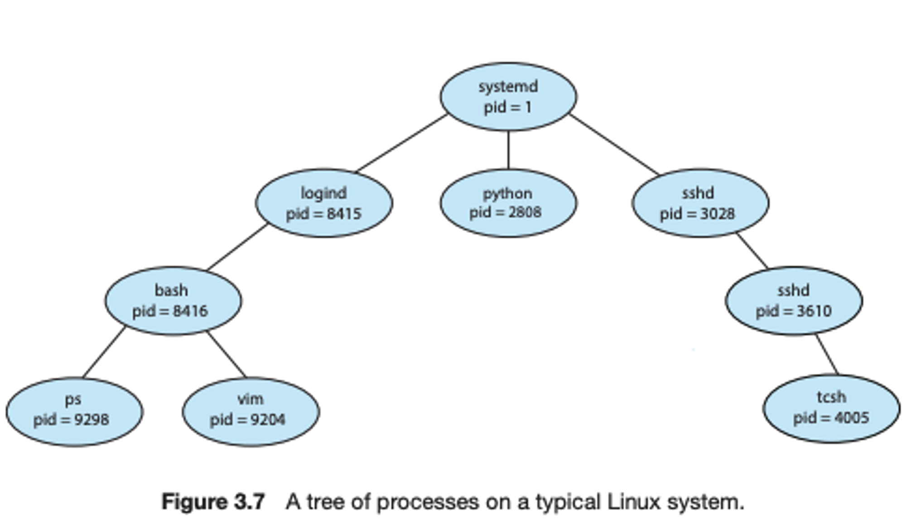
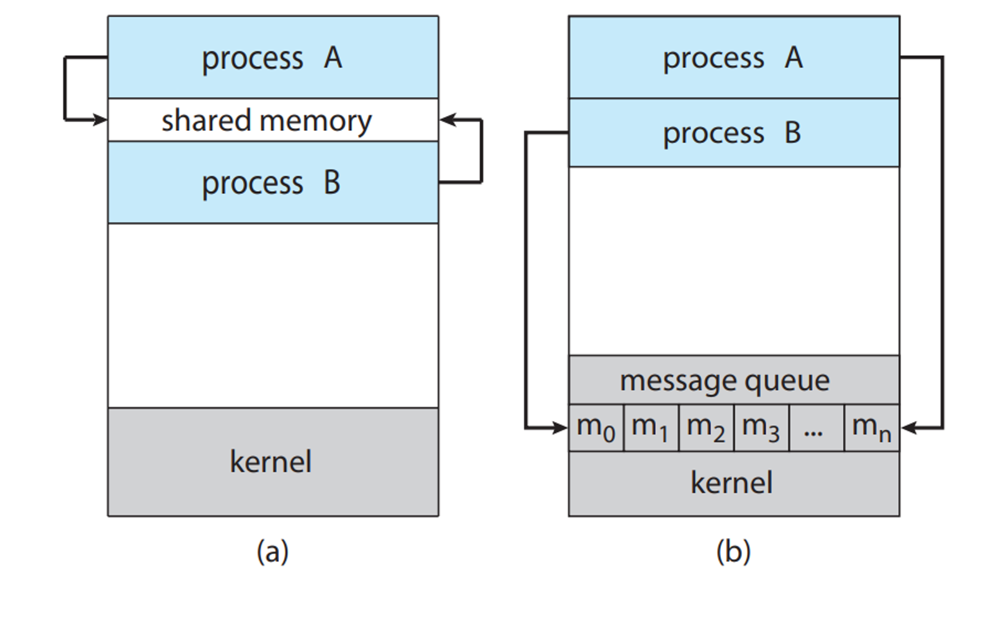

# 3. 프로세스

## 1. 프로세스 개념신
### 0. 프로그램과 프로세스의 차이

- 프로그램은 .exe 파일같이 수동적으로 이뤄지며, 프로세스를 실행시켜주는 존재면, 프로세스의 경우 능동적으로 수행하는 것이다.
- 다중 프로그래밍 : 준비 큐에서 아직 대기중인 것들, 프로그램(실행되면 프로세스)을 CPU 메모리 위에 올려 놓는 것
- 다중 테스킹 : 여러 작업들을 동시에 하는 것 처럼 보이는 것(일종의 스레드 같은 개념), 대기큐나 스레드로 계속 사용되는 것

### 1. 프로세스의 개념

⇒ 모든 CPU가 하는 활동들을 프로세스라 한다. 비공식적으로는 프로세스는 실행중인 프로그램이다.

1. 프로세스 구성

- 스택영역: 함수 호출시 임시데이터 저장장소
  (활성레코드)
  ex) 함수 매개변수, 복귀 주소
- 힙 영역: 동적으로 할당되는 영역
  ex) 인스턴스
- 데이터 영역: 전역변수들을 관리하는 영역
- 텍스트 영역: 프로그램의 코드를 관리하는 영역

### 2. 프로세스의 상태

- 생성 : 프로세스가 새로 생긴 상태
- 준비 : CPU를 차지하기전 대기중인 상태
- 대기 : CPU에서 잠깐의 실행 후 다음 이벤트를 대기 중인 상태
- 실행
- 종료

### 3. 프로세스 제어 블록(Process Control Block - PCB)

⇒ 프로세스에 관한 여러 정보가 담겨있는 블록을 뜻한다.

- 프로그램 카운터 : 프로세스가 다음을 가르킬 프로세스와 주소가 적혀있다.
- 레지스터( CPU가 요청을 처리하는데 필요한 정보를 일시적으로 저장하는 저장소) : 프로세스가 다시 스케줄 될 때 계속 올바르게 실행되도록 인터럽트 발생시 반드시 저장되어야한다.
- 프로세스 상태
- 프로세스 번호
- 메모리에 관한 정보
- 회계 정보

## 2. 프로세스 스캐줄링
### ❇️ 모르는 것 정리

1. 오버헤드 : 현재 프로세스와 동떨어진 위치의 코드를 실행시키는데 필요한 시간, 메모리, 자원들이 쓰이는 것

### 정리

- 하나의 CPU 코어는 하나의 프로세스만 처리가 가능하다 ⇒ 이때 CPU에 어떤 프로세스를 올릴지 순서를 정하는 것이 바로 프로세스 스케줄러이다.
- CPU 코어가 여러개 인 것은 여러 프로세스를 동시에 수행가능하다. 이때 프로세스의 수행량 정도를
  ’다중 프로그래밍 정도’ 라고한다
- 프로세스의 동작의 정도에 따른 프로세스 분류
    - CPU bound 프로세스
    - I/O bound 프로세스
- 스캐줄링 큐 - 주로 Linked List로 이루어져 있다.
    - 준비 큐: CPU 코어에서 프로세스가 작업되기 전 혹은 디스패치(순서 없이 바로 작업) 대기하는 큐
    - 대기 큐 : 작업 수행 중 프로세스가 특정한 이벤트가 발생하여 실행을 잠시 중단하고 대기하는 큐

- CPU 스캐줄링
    - CPU가 작업을 과부화되지 않도록 하거나, CPU를 너무 오래 잡아먹지 않도록하는 것
    - 대표적으로 스와핑이 있다.
        - 모든 것을 메모리에 올려 놓는 것이 아닌 디스크를 사용하여, 저장했다가 필요한 경우 다시
          프로세스를 메모리에 올려서 작업을 하는 방법
        - 스왑아웃 :  메모리에 올려놓은 프로세스를 디스크에 저장하는 것
        - 스왑 인 : 디스크에 있는 프로세스를 다시 메모리에 올려놓는 것

- 문맥 전환(Context Switching)
    - 디스패치나 여러 이벤트로 인해 프로세스가 전환되는 중 생기는 과정
    - PCB에 전환되는 정보들을 저장(프로세스 카운터, 레지스터)
    - 하드웨어어 크게 자우된다.
    - 단계
        1. 현재 상태를 저장하는 작업
        2. 저장한 것을 복구하는 작업

## 3. 프로세스에 대한 연산
### 정리

- 실행되는 동안 하나의 프로세스로부터 모든 프로세스들이 시작되는 것을 볼 수 있다 → 트리 모양
    - systemd , pid = 1 ⇒ 가장 첫 번째로 수행되는 프로세스

- Linux, Window 같은 것들은 프로세스를 유일하게 식별하는 식별자(pid)가 존재한다
- 프로세스는 다른 프로세스를 생성할 수 있다.
    - 부모 프로세스가 생성하는 방법
        - 한정된 크기의 부모 프로세스를 받음으로써 메모리의 과부화를 방지할 수 있다.
        - 메모리 공간의 크기뿐만 아니라 초기화 데이터를 자식에게 물려줄 수 있다
        - Linux : fork(), Window: CreateProcess()
            - 둘 다 부모 프로세스로부터 복사하는 방식이나, window같은 경우는 10가지 이상의
              설정값들을 기입해 줘야한다.
            - fork()같은 경우 부모 프로세스의 반환 값으로 자식의 pid값을 반환하고,
              자식 프로세스의 반환 값으로는 pid=0을 반환 받는다.
              이때 자신만의 pid값은 fork()의 반환값과 다른 것이다.
            - fork() 반복 시 시작된 지점으로부터의 모든 값들을 복사한다.
                - ex) 반복문을 이용한 10번의 fork()시 1024개의 프로세스가 생성된다.
    - 운영체제로부터 직접 얻는 방법
- 프로세스의 종료
    - 부모의 프로세스는 자식 프로세스가 모두 종료되어야 종료가 가능하다
      → wait()으로 반환값을 받아 종료, 이를 연쇄식 종료라 한다,
    - 잘못된 프로세스 종료 시 발생하는 문제점
        - 좀비 프로세스: 자식프로세스가 종료되었지만 부모 프로세스가 wait()을 호출하지 않아
          남아있게되는 프로세스이다. 프로세스는 보통 아주 짧게 좀비 프로세스가 되곤한다.
          wait() 호출 시 이 좀비 프로세스들의 pid와 프로세스 테이블은 운영체제에 반환
        - 고아 프로세스: 자식 프로세스가 아직 작동중이지만 부모 프로세스가 종료된 경우
            - 해결방안
                - 직접적으로 죽이는 방법(kill()), 재부팅(운영체제가 모든 자원 회수)
                - Linux의 경우 최상위 프로세스 init이 주기적으로 확인하여 자신의 자식프로세스로 귀속시킨후 종료시킴
                - Window의 경우 고아 프로세스를 주기적으로 확인하는 프로세스를 두어 종료시킨다.
            - 문제점 : 리소스 낭비, PCB의 미반납으로 인해 process의 생성이 막힐 수 있다.

## 4.프로세스간 통신(Interprocess Communication - IPC)
### 0. 프로세스간 통신 이유

→ 프로세스간의 통신을 하지 않으면, 그 프로세스들은 독립적인 것들이다. 그러나 통신을 할 경우 그 프로세스들은 협력적이라고 할 수 있다.

### 1. 메모리 공유방식

- 같은 메모리를 프로세스들 간에 공유하는 방식
- 초기 설정만 해놓으면, 빠른 속도로 자원을 공유하는 것이 가능하다.
- 같은 자원의 접근 등의 충돌 고려해야 한다.
- 클라이언트 - 서버 관점으로 보았을 때
    - 소비자인 클라이언트가 있지도 않은 자원을 끌어다 쓸 수 없도록 한다.
    - 생산자인 서버는 해당 메모리에 생성된 자원을 넣어놓고, 해당 메모리 용량이 가득차면 더 만들지 않도록 한다. (유한 버퍼인 경우)
- 예시로는 POSIX API가 있다.

### 2. 메시지 전달 방식

- 별도의 프로세스(메일 박스, MACH의 경우 port, 이들은 process이기에 pid를 갖고 있다.)를 이용하여 메시지들을 전달하는 방식
- 자원간의 접근 충돌을 하지않아도 된다.
- 보통 자원에 대한 접근은 kernel을 사용하여 접근을 한다 → 즉 자원의 주소를 통하여 접근하는 방식(
  MACH 메시지 전달 방식)
- 직접 접근하는 방식과 간접 접근 방식이 있다.
- Window의 ALCP 방식도 있다.
    - 연결 포트를 이용해 연결한 후 동일한 포트를 공유하며 서로의 핸들을 갖는 방법
    - 대용량일 경우 공유 색션 객체를 이용하여 교환

### 3. 동기화와 비동기화

- 하나의 통신이 수행될 동안 같은 류의 다른 통신은 일채 하지 않는 것을 동기화(봉쇄형)이라 하고, 그것과는 별개로 작업대로 통신을 하는 것을 비동기화(비봉쇄형)이라고 한다.

### 4. 파이프

- 일반적으로는 한 방향으로만 통신하는 반이중방식을 지원한다.(읽기 종단, 쓰기 종단이 존재)
    - 그래서 양쪽 통신을 원할 경우 두 개의 파이프가 필요
    - 동일한 기계상의 두 프로세스끼리만 통신이 가능하다.
- 데이터 송수신 후에 일반파이프들은 사라지게 된다.

(a): 메시지 전달 방법 (b) : 공유 메모리를 활용하는 방법

## 5. 클라이언트 서버간의 통신
- 네트워크 상에서의 통신도 IPC와 크게 다를 것 없다
- 방법
    - Socket: 일종의 서로 통신하기로 약속한 것이다, 이것을 통해 서로 어디로 주고 받을 지 정한다.
    - RPC
        - 소켓을 발전시킨 것으로, 애플리케이션 층 딴에서 더 확장시킨 IPC이다
        - 마찬가지로 IPC에서도 사용이 가능하다.
        - 메시지 기반 통신을 한다.
        - 스텁 : 원격서버를 찾고, 매개변수를 정돈해주는 것, 자세한 사항들을 숨겨준다.
            - MS사에서는 이를 위하 코드 MIDL을 제공한다.
        - XDL : 자유분방한 데이터 표현방식을 정한 방법들 중 하나.
        - 순서
            1. 클라이언트가 원격 프로시저 호출
            2. RPC가 그에 대응하는 스텁 호출
            3. 스텁은 원격 프로시저가 필요로하는 매개변수 전달
            4. 스텁은 원격 서버의 포트를 찾고, 매개변수 정돈
            5. 스텁은 메시지 전송 기법을 사용하여 서버로 전달
            6. 서버는 이에 대응하는 스텁을 통하여 수신한 뒤 처리 후 스텁으로 송신
- 스텁이 포트를 찾는 방법
    1. 지정되어 있는 포트번호를 가져오는 것
    2. 운영체제에 미리 정해져 있는 고정 RPC포트를 통해 matchmaker제공 받아 포트를 탐색 후 제공