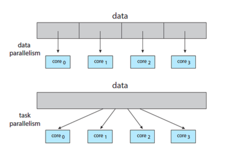
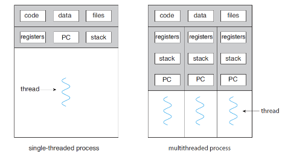
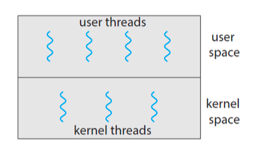
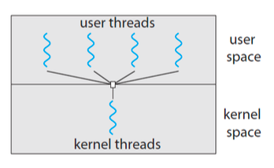
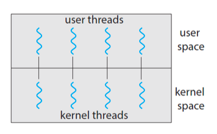
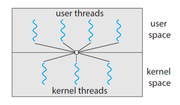

# 스레드와 병행성

    Chapter 4 학습 목표
    1. 스레드외 기본 구성요소를 식별하고 스레드와 프로세스를 차이점을 파악한다.
    2. 다중 스레드 프로세스를 설계할 때의 주요 이점과 문제점을 이해한다.
    3. 스레드 풀, 포크 조인 및 그랜드 센트럴 디스패치를 포함하여 암시적 스레딩에 대한 다양한 접근방식을 이해한다.
    4. Windows 및 Linus 운영체제가 스레드를 어떻게 사용하는지 이해한다.
    5. Pthread, Java 및 Windows 스레딩 API를 통해 다중 스레드 응용 프로그램을 설계한다.

<br><br>

## 4.1 스레드

- 스레드는 CPU 이용의 기본 단위이다.
- 어떠한 프로그램 내에서, 특히 프로세스 내에서 실행되는 흐름의 단위를 말한다.
- 경량 프로세스라고도 불린다.

### 4.1.1 스레드 사용 이유

하나의 코어는 하나의 작업을 처리할 수 있다. 즉, 다중 코어 시스템에서는 여러 작업을 동시에 처리할 수 있다는 것이다.

또한 오늘날에는 응용 프로그램이 **여러개의 비슷한 작업을 수행해야하는 경우**가 있다.
예를 들면, 웹 서버를 생각해보면 다수의 클라이언트들에게 동일한 서비스를 제공해야하는 경우이다.

만약 웹 서버가 단일 스레드 프로세스로 작동한다고 생각해보자.
기술이 발전해서 웹 서버가 다중 코어 시스템으로 구성되어있다고 해도, 단일 스레드 프로세스라면 코어의 개수만큼의 클라이언트들에게만 동시에 서비스를 제공할 수 있다.

<p align="center">

</p>

하지만 오른쪽 사진과 같이 다중 스레드 프로세스를 사용한다면, 더 많은 클라이언트들에게 서비스를 동시에 제공할 수 있는 것이다.
<br/>즉, 다중 코어 시스템 환경이더라도 단일 스레드 프로세스를 이용하면 다중 코어 시스템의 이점을 제대로 활용하지 못한다는 것이다.

더불어 다중 스레드 프로세스는 code, data, files, registers 등과 같은 자원을 공유하기 때문에 효율적이다. <br>
이러한 이유로 오늘날에는 다수의 실행 흐름을 가진 다중 스레드 프로세스를 이용하는 것이다.

### 4.1.2 다중 스레드의 장점

- `응답성` : 스레드를 오래 점유하는 경우 **다른 스레드 작업을 분할**하여 응답성을 향상 시킬 수 있다.
- `자원 공유` : 스레드는 자신이 속한 **프로세스의 메모리와 자원을 공유**한다.
- `경제성` : **프로세스의 문맥 전환은 스레드의 문맥전환보다 비용이 크기** 때문에 비용을 줄일 수 있다.
- `규모 적응성` : 각각의 스레드가 다른 처리기에서 **벙렬로 수행**될 수있다.

<br><br>

## 4.2 다중 코어 프로그래밍

- 다중 스레드 프로그래밍은 여러개의 코어를 보다 효율적으로 사용하고 병행성을 향상시키는 기법이다.
- 하나의 코어는 하나의 스레드만 처리할 수 있기 때문에 **병행성**은 시간이 지남에 따라서 여러 작업을 순차적으로 번갈아가면서 실행된다.<br>
  하지만 스레드 실행이 여러개의 코어를 가진 CPU를 통해서 각 코어들이 하나의 스레드를 할당하여 스레드가 병렬로 실행될 수 있게하는 것이다. - `병행성` : 모든 작업이 진행되고 그 다음 작업을 진행하는 방식으로 여러 작업을 수행하는것. - `병렬성` : 둘 이상의 작업을 동시에 실행하는 것

### 4.2.1 다중 코어 프로그래밍을 위한 과제

- `태스크 인식` : 응용 프로그램이 실행되면서 병행 가능 태스크로 나누는 지점을 찾는 작업이 필요하다.
- `균형` : 분리된 태스크들이 균등하게 기여도를 가지도록 해야한다. 왜냐하면 하나의 태스크에 기여도 지나치게 높다면 각 코어 별 태스크를 나눈 의미가 없기 때문이다.
- `데이터 분리` : 각 코어들이 수행하는 태스크들 별 독립적인 데이터 영역을 가지도록 해야한다.
- `데이터 종속성` : 독립적인 태스크들이 서로 종속성이 있는지 확인 후, 종속적인 경우에는 데이터 종속성을 고려하여 동기화를 해야주어야한다.
- `시험 및 디버깅` : 다중 코어에서 병렬로 실행되는 경우 하나의 스레드에 대해 디버깅하는 것이 어렵다.

### 4.2.2 병렬 실행의 유형

<p align="center">

</p>

- `데이터 병렬 실행` : 동일한 데이터의 부분 집합을 다수의 계산 코어에 분해한 뒤 각 코어에서 동일한 연산을 실행하는 데 초점을 맞추는 것이다.
- `태스크 병렬 실행` : 데이터가 아니라 태스크(스레드)를 다수의 코어에 분배하는 것이다.
  - 즉, 독립적인 스레드들이 동일한 데이터에 대해 연산을 수행할 수 도 있고, 서로 다른 데이터에 연산을 실핼 수도 있다는 것이다.

<br><br>

## 4.3 다중 스레드 모델

<p align="center">

</p>

- `사용자 스레드` : 커널 위에서 지원되며 커널의 지원 없이 관리된다.
- `커널 스레드` : 운영체제에 의해 직접 지원되고 관리된다.
- 사용자 스레드와 커널 스레드는 `다대일`, `일대일`, `다대다` 모델을 지원한다.

### 4.3.1 다대일 모델

<p align="center">

</p>

- `다대일` 모델은 여러개의 사용자 수준 스레드를 하나의 커널 스레드와 매핑하는 것이다.
- 스레드 관리는 사용자 공간의 스레드 라이브러리에 의해서 수행된다.
- 하지만 이러한 방식은 **Blocking 시스템콜이 호출되면 call이 return 되기 전까지 프로세스를 사용할 수 없게 됩니다.**
  - 커널 스레드가 1개 이므로 하나의 스레드만 접근할 수 있기 때문입니다.
  - 즉, 다중 스레드이지만 병렬로 실행될 수 없는 것이다.
- 따라서 **오늘날 다중 처리 코어가 대부분의 시스템에서는 다대일 모델을 사용중인 시스템은 거의 없다.**

### 4.3.2 일대일 모델

<p align="center">

</p>

- `일대일 모델`은 각 사용자 스레드를 하나의 커널 스레드로 매핑하는 것이다.
  - 각 사용자 스레드 별 독립적인 커널 스레드와 매핑되기 때문에 다대일 모델에서의 문제점을 해결할 수 있다.
  - 다대일 모델의 문제점 : Block 시스템 콜 호출 시 프로세스 봉쇄되는 문제
- 하지만 사용자 스레드 별 한의 커널 스레드를 생성하기 때문에 시스템 성능에 부담이 된다는 문제점이 있다.

### 4.3.3 다대다 모델

<p align="center">

</p>

- `다대다 모델`은 여러개의 사용 스레드를 그보다 작은 수, 혹은 같은 수의 커널 스레드로 멀티 플렉스하는 것이다.
  - `멀티플랙스` : 통신 채널을 통해 동시에 전달하는 기술
- 따라서 다대일 모델과 일대일 모델의 문제점을 모두 해결할 수 있는 모델이다.
  - 다대일 모델 문제점 : Blocking 시스템 호출 시 프로세스 봉쇄되는 문제
  - 일대일 모델 문제점 : 너무 많은 사용자 커널 생성 시 시스템 성능 부담 문제
- 하지만 다대다 모델은 실제 구현이 어렵다는 점에서 대부분의 운영체제에서는 일대일 모델을 사용하고, 현대 병행 라이브러리(Pthreads, Windows, Java)에서 다대다 모델을 사용하여 스레드에 매핑될 수 있게 한다.

<br><br>

## 4.4 스레드 라이브러리

- `스레드 라이브러리`는 프로그래머에게 스레드를 생성하고 관리하기 위한 API를 제공해준다.
- 스레드 라이브러리 구현 2가지 방법
  - 커널 지원없이 사용자 공간에서만 라이브러리를 제공
  - 운영체제에 의해 지원되는 커널 수준 라이브러릴 구현
- 대표 스레드 라이브러리
  - `POSIX Pthrea`
  - `Windows`
  - `Java`

<br><br>

## 4.5 암묵적 스레딩

- `암묵적 스레딩`은 스레딩의 생성과 관리 책임을 응용 개발자로부터 컴파일러와 실행시간 라이브러리에게 넘겨주는 것이다.

### 4.5.1 스레드 풀

- `스레드 풀`은 프로세스를 시작할 때 일정한 수의 스레드들을 미리 풀로 만들어두는 방법이다.

#### 스레드 풀을 사용해야하는 이유

    웹 서버를 생각해본다면 다중 스레드를 통해서 동시에 서비스를 제공해준다.
    이러한 방법은 많은 사용자를 가용할 수 있다는 측면에서 매우 큰 이점이 된다.
    하지만 요청마다 무한정으로 새로운 스레드를 생성하게 되면 시스템 측면에서 부담이 된다.

이처럼 일정 크기의 스레드를 만들어두면 요청마다 새로운 스레드를 생성하는 비용을 절감할 수 있다.

### 4.5.2 Fork Join

- `fork-join` 모델은 메인 부모 스레드가 하나 이상의 자식 스레드를 생성(fork)한 다음 다음 자식의 종료를 기다린 후 join하여 자식의 결과를 확인하고 결합하는 방식이다.

- 해당 모델은 암묵적 스레딩에서도 사용될 수 있다.

### 4.5.4 Grand Central Dispatch

- `Grand Central Dispatch (GCD)`는 macOS 및 iOS 운영체제를 위해 Apple에서 개발한 기술이다.
- 개발자가 병렬로 실행될 코드 섹션(태스크)을 식별할 수 있도록 하는 런타임 라이브러리, API 및 언어 확장의 조합이다.
- GCD는 실행시간 수행을 위해 태스크를 **디스패치 큐**에 넣어서 스케줄한다.
  - 큐에서 태스크를 꺼낼 때 스레드 풀에서 가용 스레드를 선택해서 태스크를 할당한다.

#### GCD 디스패치 유형

- `직렬` : 큐에서 태스크를 꺼내고 다음 태스크를 꺼낼 때 **먼저 꺼낸 태스크가 반드시 먼저 완료되야한다.**
  - 개인 디스패치 큐라고도 부른다.
  - 이처럼 순차적으로 실행되기 때문에 여러 작업을 순차적으로 실행하는데 유용하다.
- `병렬` : 직렬과 반대로 먼저 꺼낸 **태스크가 종료되지 않아도 꺼낼 수 있어 병렬로 실행 가능하다.**
  - 전역 디스패치 큐러고도 부른다.

#### 서비스 품질 클래스 (QoS, Quality of Service)

- 작업의 우선순위와 시스템 자원 할당을 관리하는 것을 말한다.
- 즉, 작업이 얼마나 중요한지 빨리 완료 되어야하는가에 따라서 자원을 효율적으로 사용하고, 응답성을 최적화할 수 있도록합니다.
- 4가지 유형

  - `QOS_CLASS_USER_INTERACTIVE` : 사용자 유형 클래스로 사용자와 즉각적인 상호 작용을 요구하는 작업에 사용된다.

    - 우선순위 : 가장 높음
    - 예시 : UI 업데이트, 애니메이션, 사용자가 버튼을 눌렀을 때 즉각적인 응답

  - `QOS_CLASS_USER_INITIATED` : 사용자 시작 클래스로 사용자가 명시적으로 시작한 작업으로 빠르게 완료되어야하지만 UI와 직접적으로 상호작용하지 않는 작업에 사용된다.
    - 우선순위 : 높음
    - 예시 : 파일 열기, 데이터 가져오기, 사용자 요청 처리
  - `QOS_CLASS_UTILITY` : 백그라운드에서 실행되는 작업으로, 긴 실행 시간이 예상되고 사용자에게 직접 영향을 미치지 않는 작업
    - 우선순위 : 중간
    - 예시 : 네트워크요청, DB쿼리, 파일 입출력
  - `QOS_CLASS_BACKGROUND` : 사용자에게 보이지 않는 작업으로, 긴 시간이 걸리며 다른 중요한 작업이 우선시 되어야하는 경우 사용
    - 우선순위 : 낮음
    - 예시 : 데이터 백업, 로그 처리

<br>

    이처럼 서비스 품질 클래스에 따라 작업이 디스패치 큐에 추가될 때 우선순위가 결정된다.
    따라서 GCD는 시스템 자원을 효율적으로 사용하고, 각 작업의 우선순위에 맞게 실행 순서를 관리한다.

<br><br>

## 4.6 스레드와 관련된 문제들

### 4.6.1 Fork() 및 Exec() 시스템 콜

- fork() 시스템 콜은 부모 스레드를 복제한 다음 다음 자식의 종료를 기다린 후 join하여 자식의 결과를 확인하고 결합하는 방식이다.
- exec() 시스템 콜은 현재 프로세스를 매게변수로 지정된 프로그램으로 대체한다.

<br>

    몇몇 UNIX는 fork() 호출 시, 부모 프로세스의 모든 스레드를 복제하는 방법과 fork()를 호출한 스레드만 복제하는 2가지 방법이 존재한다.
    만약 모든 스레드를 복제하는 경우 바로 exec를 호출한다면 비효율적이다.
    왜냐하면 자식 프로세스는 부모 프로세스와 동일한 자원을 할당받기때문이다.
    그리고 exec() 호출로 새로운 프로그램으로 대체되어 바로 종료될 수 있기 때문이다.

### 4.6.2 신호처리

- 신호에는 `동기식 신호`와 `비동기식 신호` 2가지가 존재한다.

#### 동기식 신호

- 동기식 신호는 실행 중인 프로그램이 아래와 같은 행동을 수행하면 발생한다.
  1. 불법적인 메모리 접근
  2. 0으로 나누기
- 동기식 신호는 신호를 발생시킨 **연산을 수행한 프로세스에 전달** 된다.

#### 비동기식 신호

- 비동기식 신호는 **프로세스 외부**로부터 발생하면 그 프로세스는 신호를 비동기식으로 전달받는다.
- 예를들면, <control><c> 같은 특수한 키를 눌러서 프로세스를 강제 종료 시킬때 비동기식 신호를 다른 프로세스에 전달된다.
- <control><c>, 사용자 강제 종료 등

#### 신호 처리기

    처리기 종류에는 `디폴트 신호 처리기`와 `사용자 정의 신호 처리기`가 존재한다.
    모든 신호마다 커널이 실행시키는 디폴트 신호 처리기가 있다.
    하지만 디폴트 처리기는 사용자 정의 처리기에 의해서 대체될 수 있다.

하지만 다중 스레드 프로그램에서는 신호 처리가 까다롭다. <br>
왜냐하면 어떤 스레드에 신호를 처리해야할지 모르기 때문이다.

**신호의 유형**에 따라서 신호를 전달하는 방법이 달라진다.

    동기식 신호(프로세스 내부에서 발생한 신호)의 경우는 반드시 신호를 야기한 스레드에 전달되어야한다.
    그러나 비동기식 신호(프로세스 외부에서 발생한 신호)는 명확하지 않다. (<control><c>과 같은 프로세스 종료 명령)
    따라서 비동기식 신호는 프로세스 내 모든 스레드에게 전달해야한다.

### 4.6.3 스레드 취소

- `스레드 취소`는 스레드가 끝나기 전에 그것을 강제 종료 시키는 작업을 말한다.
- 이때, 취소가 되어야하는 스레드를 `목적 스레드(target thread)`라고 부른다.
- 스레드 취소 2가지 방식
  - `비동기식 취소` : 한 스레드가 즉시 목적 스레드를 강제 종료시킨다.
  - `지연 취소` : 목적 스레드가 주기적으로 자신이 강제오료 되어야할지를 점검한다.
    - 목적 스레드가 질서정연하게 강제종료 할 수 있는 기회가 만들어진다.

#### 스레드 취소 시 고려해야하는 점

    스레드 취소를 하게 되면 반드시 스레드에 할당된 자원을 회수해야한다.
    만약 목적 스레드가 다른 스레드와 공유하는 데이터를 동기화하는 작업 중 취소 요청이 온다면 문제가 발생한다.

    심지어, 비동기식 취소의 방법으로 요청이 온다면 문제의 심각성은 더 커진다.
    -> 지연 취소와 달리 질서정연하게 강제 종료가 되지 않기 때문이다.

#### Java에서 스레드 취소 방법

위에서 설명했듯이 스레드 취소할 대 자원 회수에 대해서 문제점이 발생하게 된다. <br>
이러한 문제를 예방하기 위해서 Java 라이브러리에서는 해결책을 제시하고 있다.

```java
Thread worker;
...
worker.interrupt();

```

Java에서 스레드를 취소하기 위해서는 `interrupt()`메서드를 호출하여 대상 스레드의 인터럽트 상태를 true로 설정한다.

```java
while(!Thread.cureentThread().isInterrupted()){
    ...
}
```

그리고 해당 스레드는 자신이 인터럽트 상태를 `isInterrupted()`메서드를 반복 호출해서 확인한다.

### 4.6.4 스레드-로컬 저장장치

한 프로세스에 속한 스레드들은 그 **프로세스의 데이터를 공유**한다고 했다.<br>

하지만 상황에 따라서 각 스레드가 독립적인 데이터 영역을 필요로하는 경우가 있다.
이러한 데이터를 저장하기 위한 것을 `스레드-로컬 저장장치 (thread-local storage, TLS)`라고 부른다.

### 4.6.5 스케줄러 액티베이션

다중 스레드 프로그램을 구현하게 되면 스레드 라이브러리와 커널 통신에 있어서 문제에 대해 고려해야한다.<br>
이때, 스레드 라이브러리와 커널 스레드 간의 통신 방법 중 하나가 `스케줄러 액티베이션`이며, **커널은 응용프로그램에게 LWP의 집합을 제공하고 응용은 사용자 스레드를 LWP로 스케줄한다.**
